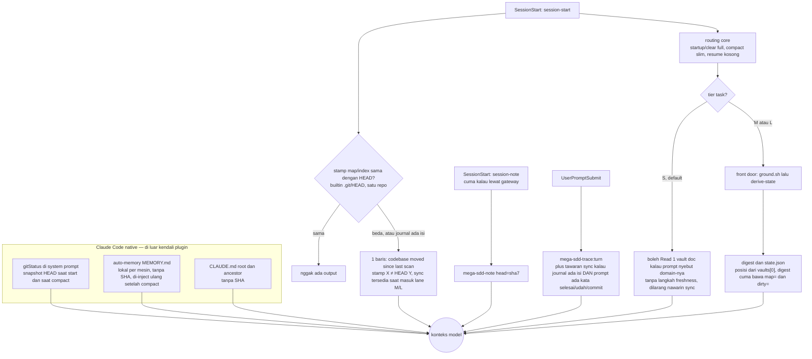
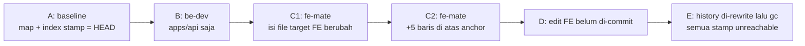

# State-anchor audit — Fase 0 (2026-09-25)

**Masukan tim:** satu monorepo dikerjain beberapa tim. Di sesi tim FE, Claude drift: dia baca memory/artefak yang udah basi, jadi salah gambarin current state. Target owner: mega-sdd selalu berangkat dari kode yang nyata di HEAD, tanpa user harus ngasih tahu ada push/pull baru.

**Yang diminta Fase 0 (read-only, belum ada perubahan kode):**
1. Peta artefak turunan yang dibaca waktu start/resume, plus mana yang udah nyimpen SHA dan mana yang belum.
2. Peta hook plus biaya spawn-nya sekarang. Budget v7.5.0 (per-prompt 1 proc) nggak boleh naik tanpa angka.
3. Mekanisme scope per tim yang udah ada. Kalau belum ada, bentuk minimalnya.
4. Reproduksi skenario drift: apa yang dipercaya Claude sekarang.

**Metode:**
- **Lane audit:** 8 lane (6 peta statis, 1 ukur spawn/ms di production path, 1 reproduksi drift di playground monorepo). Tiap lane dicek ulang verifier adversarial yang nurunin ulang semuanya dari source. Hasilnya **444 verdict**: 337 CONFIRMED, 93 CORRECTED, 13 UNVERIFIABLE, 1 REFUTED. Yang REFUTED: playground reproduksi ternyata nggak punya `config.yaml`, dan itu udah dites ulang pakai `lane: lite` (§5).
- **Lanjutan:** completeness critic, 10 gap-fill, dan 4 gap susulan.
- **Review dokumen:** 7 fact-checker per bagian + 2 lensa (disiplin Fase 0, register + higiene repo publik) nemu 162 temuan. Semuanya udah dilebur ke versi ini. Bagian yang ditambah **setelah** review dicek ulang penulis ke capture dan evidence, tapi nggak lewat review adversarial kedua: istilah, tabel §5 yang dipecah (kumulatif vs kontrol), moat-5 / moat-9 / state-6, dan range Windows di §3.
- **Rail:** plugin code **cuma** dijalanin di playground scratch, karena repo plugin ini sendiri adopted. `git status` repo dan checksum 91 file state `.mega-sdd/` identik sebelum audit dan setelah semua workflow selesai. Satu-satunya tambahan: dokumen ini dan folder `repro.sh`-nya.

**Batas bukti — baca ini dulu:**
- **Kode di trace = kode HEAD.** Versi yang kelihatan di trace kantor 2026-09-21 itu 8.7.0, dan `git diff --stat 8bf977ae e15465f3 -- plugins/mega-sdd/hooks plugins/mega-sdd/scripts` kosong. Yang beda cuma blok `.gitignore` yang disaranin di `references/paths.md` (§8). Versi plugin di **sesi drift sendiri** belum diketahui; cek field `v=` di baris `mega-sdd-note:` (§7).
- **Angka ms = macOS, MEASURED.** Angka Windows **EXTRAPOLATED**: exec × ~220 ms (pengukuran laptop kantor 2026-07-28, satu fork+exec), fork-only × 110–220 ms (belum pernah diukur). Hitungan proses "bash 5.3" pakai bash 5.3.15 yang di-build di Mac sebagai proxy Git Bash. Proses wrapper Git Bash per event (+1?) juga belum diukur. Jadi arah error angka Windows belum ketahuan.
- **Kondisi laptop kantor** ("nggak ada python3 yang bisa jalan") itu catatan 2026-07-28 dan **belum dikonfirmasi ulang** (Q3).
- **Sesi drift FE-nya sendiri belum kelihatan.** Trace 2026-09-21 itu sesi lain. Makanya §7 isinya hipotesis yang **belum bisa diperingkat**, bukan root cause.

**Istilah yang sering muncul:**

| Istilah | Artinya |
|---|---|
| UPS / UPE | hook UserPromptSubmit / UserPromptExpansion |
| GROUND | `scripts/ground.sh` di front door `/mega-sdd` (jalanin `derive-state` + rebuild symbol index) |
| step 3.7 / 3.9 / 5 | pre-flight `execute-bolts`: cek anchor (`check-anchor-freshness.sh`) / JIT bind per unit / rebuild symbol index |
| Pass-5 recertify | leg di `validate-handoff-binding-units.sh` yang bandingin head binding classic ke HEAD |
| B2 / B4 | gate `_batch-suite.json` (suite hijau harus nutup commit kode terbaru) / gate `acceptance.json` |
| T1 / T2 | tier di prompt dispatch `bolt-implementer`: isi unit verbatim / slice tambahan (simbol, reuse) |
| CP, `ctl-*` | checkpoint di rantai reproduksi; `ctl-*` = kontrol yang dibangun langsung dari A (satu perubahan doang) |
| repo plugin | repo ini (`mega-sdd-github`: 1.145 commit / 1.983 file per HEAD e15465f3) |

## Verdict singkat

1. **"Kode di HEAD = source of truth" belum ketulis di mana pun yang dilihat model.** Satu-satunya cek SHA di awal sesi adalah stamp map/index satu repo vs HEAD, dan outputnya cuma satu baris notice tanpa scope. Notice ini ikut nyala di sesi FE gara-gara commit BE. Notice ini **mati total** kalau nggak ada interpreter python sama sekali, kondisi yang tercatat di laptop kantor 2026-07-28 (belum dikonfirmasi, Q3). Tier S, yang jadi default buat "pertanyaan soal kode", ngizinin baca 1 vault doc tanpa langkah freshness (kalau prompt-nya nyebut domain vault itu), dan ngelarang nawarin sync.
2. **Di monorepo, state-nya project-wide.** Stamp, journal, `.validation-blockers.json`, dan `state.json` masing-masing cuma satu. Posisi dan chain yang diusulin front door dihitung dari `vaults[0]` (urutan generasi, lalu abjad). Akibatnya:
   - Sesi dari subdir mana pun dikasih posisi/chain milik `vaults[0]`. Di playground kebetulan itu vault BE. Ini cuma nyampe ke model lewat jalur M/L atau kalau model baca `state.json`.
   - Hotfix BE di file yang di-anchor binding BE nutup gate `execute-bolts` FE. Commit kode apa pun juga nutup lewat B2.
   - GROUND yang dijalanin tim mana pun bisa **ngapus bukti drift FE** di project yang cuma punya symbol index (tanpa codebase-map): index di-restamp, changed set jadi 0 path, notice hilang. Syaratnya ada di §2g-3, dan semua terukur di bawah syarat itu.
3. **File unit (`units/U-*.md`) nggak nyimpen SHA sama sekali.** `head` di per-unit `binding.json` (lane lite) ditulis tapi nggak pernah dibaca siapa pun. Anchor `file:line` cuma dicek "file ada + baris masih dalam range".
   - Commit teammate yang nggeser baris di atas anchor lolos step 3.7 dan lolos JIT bind (CONFIRMED, head di-restamp ke HEAD tapi pakai index lama).
   - Commit itu juga lolos gate Skill + Agent begitu suite B2 hijau lagi. Tetap sama dengan `lane: lite` beneran.
   - Prompt implementer bawa anchor T1 yang basi **dan** baris T2 yang bener. Dua-duanya BINDING tanpa aturan mana yang menang. Implementer-nya sendiri nggak dijalanin, jadi fungsi mana yang bakal dia edit belum diobservasi.
4. **Mekanisme terdekat ke "SHA + name-only diff yang di-scope" udah ada: Pass-5 recertify.**
   - Batasannya:
     - cuma bisa **nge-block** di gate `execute-bolts`;
     - cuma buat lane classic;
     - head-nya diketik model, bukan di-stamp script;
     - dilewatin **diam-diam** kalau SHA-nya nggak dikenal (udah di-gc, atau nggak pernah di-fetch).
   - Kembarannya di sync lane: `derive-changed-paths` → `sync-intersect`, yang scope-nya per vault.
   - Dua-duanya nggak pernah jalan waktu model sekadar baca.
5. **Biaya primitif deteksi (Mac, MEASURED):**
   - baca `.git/HEAD` pakai builtin: 0 proses, ~0,2 ms;
   - satu `git diff --name-only A..HEAD -- <scope>`: 1 proses, 13–18 ms. Di Windows tiap exec `git` ≈ +220 ms (EXTRAPOLATED).
   - Hook per-prompt sekarang = **1 exec tapi 2 proses** (fork `$(resolve_project_root)` nggak kehitung pin). Jadi "1 proc" cuma bener di definisi exec (Q6).
6. **Penyebab drift FE belum bisa dipastiin dari repo.** Ada beberapa kandidat yang mekanismenya udah kebukti ada, tapi belum bisa diperingkat:
   - auto-memory native;
   - CLAUDE.md root;
   - jalur plugin: tier-S read, digest `vaults[0]`, atau `state.json` basi.
   
   Sebagian bisa digugurin tanpa trace (misalnya setting auto-memory). Sisanya butuh trace sesi drift itu (checklist di §7).

## Contents

- [1. Yang model lihat waktu sesi mulai](#1-yang-model-lihat-waktu-sesi-mulai)
- [2. Peta artefak turunan dan anchor-nya (ask 1)](#2-peta-artefak-turunan-dan-anchor-nya-ask-1)
- [3. Hook dan biaya spawn (ask 2)](#3-hook-dan-biaya-spawn-ask-2)
- [4. Scope per tim (ask 3)](#4-scope-per-tim-ask-3)
- [5. Reproduksi drift (ask 4)](#5-reproduksi-drift-ask-4)
- [6. Bukti dari run benchmark nyata](#6-bukti-dari-run-benchmark-nyata)
- [7. Hipotesis penyebab drift FE dan cara mutusinnya](#7-hipotesis-penyebab-drift-fe-dan-cara-mutusinnya)
- [8. Temuan sampingan (dilaporkan, belum disentuh)](#8-temuan-sampingan-dilaporkan-belum-disentuh)
- [9. Pertanyaan buat owner (gate)](#9-pertanyaan-buat-owner-gate)
- [10. Koreksi dan catatan metode](#10-koreksi-dan-catatan-metode)

## 1. Yang model lihat waktu sesi mulai

**Injeksi per source** (terukur; token ≈ byte/4):

| Source | Yang di-inject | Byte (superpowers ada / nggak ada) |
|---|---|---|
| startup, clear | routing core penuh (tabel tier S/M/L, prohibisi tier S, hard rule) | 4.084 / 4.359 |
| compact | core slim: hard rule + output language. **Tabel tier nggak ikut** | 1.883 / 2.158 |
| resume | cuma header, tanpa core | 115 / 390 |
| notice staleness (kalau nyala) | +±152 B di **semua** source, termasuk resume | — |

Fakta soal apa yang **nggak** dilihat model:

- **Nggak ada kalimat yang bilang HEAD menang atas memory/artefak**, atau bahwa artefak tanpa SHA cuma hint. Dicek pakai grep di 22 file entry (7 body hook, anchor, front door, `orchestrate-flow` + 6 ref-nya, `ground.sh`, `derive-state.sh`, `state_probes.py`, dll.).
- Klausa *"the session-start staleness notice is informational only"* (`skills/using-mega-sdd/SKILL.md:67`) ada **di bawah** marker ANCHOR-CORE (`:41`), jadi nggak pernah di-inject.
- **Teks yang ada malah nempatin vault sebagai kebenaran:**
  - `_meta/ai-consumer-guide.md` (disalin ke tiap vault) bilang vault itu *"the single source of truth for requirements"* (`:5`). Kalau vault bentrok sama kode: STOP, eskalasi (`:42`).
  - `detect-drift/SKILL.md:24` sengaja nggak milih sisi.
  - Satu-satunya baris prioritas yang nyebut CLAUDE.md (`using-mega-sdd/SKILL.md:45`) ngerangking **instruksi**, bukan kesegaran fakta, dan dia juga di bawah marker.
- **Tier S** (`using-mega-sdd/SKILL.md:15`) jadi default kalau ragu, termasuk "questions about code" dan "lanjut/next" kalau belum ada skill yang jalan. Bunyinya: *"NO pipeline — answer as plain Claude Code. May Read AT MOST ONE vault doc (read-only) if the prompt names a domain the vault owns; no ground, no derive-state, no status view, zero mega-sdd scripts."*
  - Model tetap bebas baca kode.
  - Masalahnya, nggak ada langkah freshness sama sekali, dan nggak ada suruhan ngecek kode di HEAD.
  - `:29` nambahin *"do NOT propose sync"*. Larangan ini satu paket sama `:31` (`.mega-sdd/` = *"STATUS signal only … do not auto-invoke"*), yang ngejalanin constraint owner "auto-invoke dari keberadaan `.mega-sdd` nggak boleh balik".
- **Notice staleness** (`hooks/session-start:233-323`):
  - Bandingin stamp map `last_scanned_commit` (atau `head_commit` index kalau map nggak ada) dengan HEAD hasil baca builtin `.git/HEAD`.
  - Perbandingannya string penuh, satu repo, tanpa path.
  - Teksnya bawa `stamp <8 char> ≠ HEAD <8 char>`, tapi nggak nyebut vault, path, atau artefak.
- **Digest front door** (`derive-state.sh:116-121`) cuma bawa `map=` dan `dirty=`. Di project yang cuma punya symbol index (express/lite), model baca `map=n/a` padahal `state.json` bilang index-nya basi.
- **Notice bisa diam padahal basi:**
  - nggak ada interpreter python yang bisa dipakai sama sekali (early exit di `:204-223`, sebelum blok staleness);
  - `.mega-sdd` ada di bawah git toplevel;
  - `staleness_notice: false`;
  - map legacy di root repo;
  - stamp ada setelah baris ke-40 map (hook cuma baca 40 baris pertama);
  - ref file tanpa newline di akhir (bentuk sintetis; git selalu nulis LF).
- **Notice bisa nyala terus padahal nggak ada apa-apa:**
  - map/index di-commit (stamp nggak mungkin sama dengan commit yang berisi dirinya);
  - map CRLF, jadi muncul `stamp 4df1e900 ≠ HEAD 4df1e900`;
  - `head_commit: null` di index: parser builtin ngambil string berkutip berikutnya, jadi stamp kebaca `astgrep_…` dan nggak akan pernah sama dengan HEAD;
  - stamp berupa literal `HEAD` atau short sha;
  - baris journal dari tim mana pun.
- **session-note** ngasih `head=<sha7>` yang live (cuma kalau lewat gateway), tapi nggak dipasangin ke klaim artefak mana pun.

## 2. Peta artefak turunan dan anchor-nya (ask 1)

Legenda anchor: **git** = SHA commit; **hash** = sha256 isi; **line** = `file:line`; **mtime/ts** = waktu; **—** = nggak ada.
Kolom "dibandingkan oleh" = siapa yang beneran nyocokin anchor itu ke HEAD atau working tree. Kalau isinya "nggak ada", stamp itu cuma hiasan.

### 2a. Dibaca di entry (SessionStart, front door, GROUND, resume)

| Artefak | Penulis | Anchor | Granularity | Dibandingkan oleh | Kalau beda |
|---|---|---|---|---|---|
| routing core (anchor) | file plugin statis | — | — | — | — |
| `codebase/codebase-map.md` `last_scanned_commit` | script (`derive-codebase-map.sh:545-550`, ada guard literal-HEAD) | git | project | `session-start:314`; `state_probes.py:656-657` | notice; posisi `maintenance_sync` kalau `vaults[0]` ter-bind, ada change signal, dan nggak kalah sama `oq_gate` / `prd_revision` (`state_probes.py:1293-1321`) |
| `codebase/symbol-index.json` `head_commit` | script (`build-symbol-index.sh:63-69`) | git | project | `session-start:314` (kalau map nggak ada); `state_probes.py:549-550` | notice / change_signal (leg index nggak pernah muncul di digest) |
| `codebase/.dirty-paths.jsonl` | hook PostToolUse | ts per baris | file | — (cuma dihitung barisnya) | ikut nyalain notice; tawaran sync di UPS |
| `state.json` | `derive-state.sh` | ts + `probes.git.head` | project | **nggak ada** yang bandingin `probes.git.head` | dipakai apa adanya oleh `resolve-framework-pack.sh:309-318`, `validate-preflight.sh:120-148` (mode `--predictive`), `derive-changed-paths.sh:46-54` |
| vault dir (presence, mode, mtime) | pipeline | mtime | vault | mtime PRD vs vault (`state_probes.py:1297-1308`) | posisi `prd_revision` (bukan cek kode/HEAD) |
| `binding.md` `binding_metadata.head` | **model** (bind Step 4, `bind-codebase/SKILL.md:83`) | git (format nggak divalidasi) | vault | di entry nggak ada. Di gate: `validate-handoff-binding-units.sh:568` | lihat §2b |
| per-unit `bolts/U-*/binding.json` `head` | script (`write-unit-binding.sh:37,210`, short=8) | git | unit | **nggak ada**; `state_probes.py:852-858` cuma ngitung jumlah | — |
| `DRIFT-REPORT.md` / `PENDING-SYNC.md` | model | SHA di prosa header + mtime | vault | — (recency lewat mtime, `state_probes.py:1414-1421`) | usul detect-drift (buat `vaults[0]` aja) |
| `factory-ledger.json` | nggak ada writer script; instruksi rebuild di prosa `--deep` (`factory-routing.md:36`) nggak pernah dijalanin (§8 state-8) | ts | — | — | tawaran `--resume` di anchor bergantung ke file ini |
| `.validation-blockers.json` (dibaca UPE) | `validate-handoff-binding-units.sh`, dipanggil dari gate PreToolUse, `rebind-units.sh`, analyze, step 3.9, bind handoff validation, CI | ts | project | UPE baca **cache**, nggak re-derive (`user-prompt-expansion:46-51`) | UPE nge-print `{"decision":"block"}` dari verdict lama; apakah harness beneran nge-block belum diverifikasi |
| `.plan-pending` | skill | mtime | project | — | **keberadaannya** aja udah nge-arm gate (`pre-tool-use:500`) |

### 2b. Vault, binding, units (classic, lite, legacy)

| Artefak | Penulis | Anchor | Dibandingkan oleh | Catatan |
|---|---|---|---|---|
| vault docs (legacy 7-file, layout-2, layout-3 `context.md`) | model | versi / `prd_sha256` (hash PRD, bukan kode) | — | resolver & deriver = parser murni |
| `binding.md` + `binding.json` (classic) | model + `derive-binding-json.sh` (salin verbatim) | git (head) + `claims[].anchor` line | **Pass-5 recertify** (`validate-handoff-binding-units.sh:540-653`) | yang bisa nge-block cuma gate execute-bolts / bolt-implementer. Validator-nya juga dipanggil dari `rebind-units.sh:122`, `run-analyze.sh:435`, bind handoff validation, step 3.9, dan CI. **Nggak pernah** jalan di entry atau waktu model cuma baca |
| `claims-ledger.json` | script | hash tiap vault doc (`doc_shas`) | — (`doc_shas` nggak punya konsumen) | — |
| `bound/` | script | — (mirror head) | — | `bound/binding.md` nggak ke-glob validator |
| `units/U-*.md` | model | **nggak ada SHA**. Cuma `## Anchors` line + `target_files` | step 3.7 (prosa): existence + range | jadi advisory kalau unit "udah punya bolt commit", artinya ada commit ber-atribusi U-id itu di 300 commit terakhir **seluruh repo**, dari vault mana pun (`check-anchor-freshness.sh:169-178`, `postflight_rules.py:39-50`) |
| `bolt-report.md` `target_hashes` | **model** (tanpa writer/validator script) | hash per file | `compute-unit-staleness.sh:93-104` vs **working tree**; jalan di sync / reconcile / `derive-ready-units` (lite) | field hilang → `unknown`, diperlakukan nggak stale |
| `bolts/_wave-claims.json` | script | git short8 | — | — |
| `.plan-coverage-state.json` | script | ts + path PRD | — (reader cuma cek `status == PASS`) | satu per project; path PRD dicatat tapi nggak dicek; nggak ada identitas vault/hash PRD |
| `vault.json` | script | `prd_sha256`, `constitution_hash` | WARN kalau `constitution_hash` drift | bukan git |

**Blind spot Pass-5 recertify.** Di tiap kasus di bawah, recertify PASS. Gate kebuka kecuali ada gate lain yang nutup (biasanya B2 di level Skill).

1. File yang di-anchor di-rename (`--name-only` cuma lapor path baru).
2. Edit working tree yang belum di-commit.
3. Commit yang subject-nya `<type>(U-xxx):` / `(bolt): U-xxx`, atau yang punya trailer `Unit:`. Commit kayak gini dianggap commit bolt dan nggak dihitung, **dari vault mana pun**, karena `unit_of()` (`postflight_rules.py:23-36`) nggak ngecek vault. Subject yang cuma *nyebut* U-id di prosa tetap dihitung.
4. Klaim NEW/OQ dengan anchor `—`.
5. Head berupa literal `HEAD` (range kosong, jadi advisory doang).
6. SHA nggak dikenal atau udah di-gc: `continue` **tanpa jejak** (`validate-handoff-binding-units.sh:599-602`). Timeout 15 s punya jalur yang sama; ini dari kode, belum direproduksi.
7. Binding tanpa head, atau tanpa `binding.json` → advisory.

Selain itu, validator moat cuma nge-glob `.mega-sdd/vaults/*` (`validate-handoff-binding-units.sh:109-131`). Yang **nggak kelihatan**:
- vault di `docs/mega-sdd/vaults/` (CONFLICT aktif di sana → PASS, terukur);
- vault di root `vaults/`;
- vault yang nested lebih dari satu level.

Vault legacy tanpa `vault.json` juga nggak kelihatan di front door (`probe_vaults`).

**Lite:**
- Per-unit `binding.json` **nggak pernah di-re-derive oleh hook**. Hook cuma baca verdict yang tersimpan (`validate-handoff-binding-units.sh:688-710`). `binding.json` lama dengan 0 CONFLICT membuka gate, begitu juga unit **tanpa** `binding.json`. Re-verdict cuma terjadi lewat prosa step 3.9 atau `rebind-units.sh`.
- CONFLICT per unit cuma nge-block unit yang disebut `AGENT_UNIT` (hit regex pertama di prompt Agent, `pre-tool-use:306-311`). Di level Skill, dan di prompt Agent yang nggak nyebut atau salah nyebut unit, CONFLICT OPEN cuma jadi advisory.
- OQ per unit nggak pernah nge-block.
- ID unit dicocokin pakai basename polos **lintas semua vault**. CONFLICT di U-001 milik vault A bisa nolak dispatch U-001 milik vault B yang bersih (terukur).

### 2c. Dispatch ke implementer

`build-dispatch-prompt.sh` nyalin state turunan ke prompt `bolt-implementer` **tanpa cek HEAD**:

- Symbol slice berlabel `index@<head8>` (*"trusts head_commit as provenance, not verdict"*, `:2347-2349`). Index di-rebuild sekali per run di step 5, tapi step 3.9 (JIT bind) jalan **sebelum** step 5, jadi verdict JIT pakai index lama. Index itu juga dibangun dari working tree tapi di-stamp HEAD.
- Label confidence `[HIGH]/[MEDIUM]/[LOW]` dari `binding.md` (`:3009-3018`).
- Baris §6 codebase-map (`:2823-2835`), cuma sebagai fallback kalau `starterkit-context.yaml` nggak ada, dilabel "informational, never a gate".
- Ringkasan `bolt-report` upstream (`:1881-1905`).
- `reuse-index.yaml` sebagai "PRIMARY reuse lookup surface". `generated_from`-nya nggak pernah dibaca.
- Slice `starterkit-context.yaml`. Dia nggak punya `generated_from`, cuma `generated_at` + cache signature per slice, dan yang baca itu cuma gate cache deep-scan milik scan sendiri.

Satu-satunya probe per dispatch cuma anchor path + range, dan builder-nya jujur soal ini: `anchors_verified: 2/2 (path + line-range only — content drift NOT checked)` (`:1348`).

**Kontrak trust di sisi implementer:**
- `agents/bolt-implementer.md:16`: *"Every INSTRUCTION and every VALUE in it is BINDING on you — exactly as binding as this system prompt."* Pointer-nya ngulang hal yang sama (`build-dispatch-prompt.sh:3708`).
- Anchor T1 **dan** baris simbol T2 sama-sama "VALUE" yang BINDING. Cuma teks di sisi controller yang nyebut index "advisory" (`execute-bolts/SKILL.md:68`, `context-enrichment.md:190-191`), dan implementer nggak pernah lihat teks itu. Jadi waktu T1 bilang `login` di `:6` dan T2 bilang di `:11`, implementer dapet dua nilai BINDING yang kontradiksi, tanpa aturan mana yang menang.
- Instruksi "cek dulu" cuma ada kalau probe existence+range gagal: `ANCHOR STALE (verify before use)` (`:1340`). Anchor yang geser tapi masih dalam range nggak dapet label apa-apa.
- **Nggak ada tipe halt yang pas.**
  - Implementer cuma punya `test_fail`, `hard_rule_violated`, `ambiguous_spec`, `dep_missing`, `scope_creep_detected` (`bolt-implementer.md:55-59`), dan `:70` nyuruh blocker yang nggak cocok dibiarin untyped.
  - Di sisi controller, `anchor_missing` cuma dimiliki step 3.7, dan step itu lolos di skenario ini.
- `dispatch-prompt.md` **nggak di-build ulang** di fix round (`review-panel.md:103`), jadi `index@<head8>`, `anchors_verified`, dan slice reuse dari attempt pertama kebawa terus.

### 2d. Scan dan sync

| Mekanisme | Baseline | Cara bandingin | Scope | Kapan jalan | Kalau beda |
|---|---|---|---|---|---|
| `scan-codebase --changed-only` (hop 1 sync di project **yang punya map**) | map `last_scanned_commit` | `git diff --name-only stamp..HEAD` ∪ porcelain ∪ journal; verifikasi `<stamp>^{commit}`, fallback full scan | satu repo | sync lane, **dijalanin model** | stamp map dimajuin sebelum irisan |
| `derive-changed-paths.sh` (hop 1 di project **tanpa map**: express/lite) | `state.json` `probes.symbol_index.head_commit`, fallback index live | tree diff `stamp..HEAD` ∪ porcelain ∪ journal | **satu repo**; set lama selalu di-union (`:133-140`) | sync lane | tulis `.sync-changed-paths.txt`; rc 3 kalau baseline nggak ada, `git diff` gagal (stamp nggak kejangkau), git nggak ada, atau write gagal |
| `sync-intersect.sh` | changed set | irisan dengan anchor binding ∪ `target_files` ∪ `## Anchors` (`:128-258`) | **per vault** (scope turunan terbaik yang ada) | sync lane | rc 0 `in_sync` / rc 4 `reconcile_needed` |
| `check-anchor-freshness.sh` (step 3.7) | — | file ada di `git ls-files` + baris pertama ≤ jumlah baris (working tree) | per unit | prosa step 3.7 | halt `anchor_missing` kalau unit belum punya bolt commit (lihat §2b); advisory sesudahnya |
| `compute-unit-staleness.sh` | `target_hashes` | sha256 vs working tree | per file | sync, reconcile, `derive-ready-units` | `stale` |
| `graph` (`build-graph.sh:352-359`) | `binding.json` head vault (classic) | string `!=` HEAD **saat build** | vault | on demand | banner "Anchors may be stale" (beku sejak build; vault lite nggak pernah dapet banner ini) |

### 2e. Vektor "memory" (lintas sesi)

| Surface | Penulis | Anchor | Plugin bisa ngatur? |
|---|---|---|---|
| auto-memory `MEMORY.md` + topic files | Claude Code native | — (topic file dapet `modified` sejak cc ≥2.1.214, itu pun cuma yang udah punya frontmatter) | nggak. Plugin nggak pernah baca atau nulis (0 hit grep). Default-nya lokal per mesin |
| `CLAUDE.md` root/ancestor/user | native / manusia | — | nggak. Plugin cuma nawarin import `@AGENTS.md` dengan izin |
| gitStatus di system prompt | native | git (5 sha pendek + branch) | nggak. Akurat saat start dan saat compact, basi setelah pull di tengah sesi |
| `AGENTS.md` | `emit-agents-md`: otomatis di akhir chain `--deep`/`--auto` di spine classic, atau `--full`; dilewati di express (default) dan profil lean | ts + `vault_version` + `constitution_hash` | nggak ada pembanding. Dibaca native kalau Claude Code ≥2.1.277 dan nggak ada CLAUDE.md; `AGENTS.mega-sdd.md` (mode sibling) nggak pernah dibaca native |
| `.claude/rules/mega-sdd-*.md` | `emit-claude-rules.sh` (offer-only) | hash constitution[:12] | path-scoped `paths:` dari `target_files`; isinya norma, bukan state |
| `<vault>/.memory/bolt-outcomes.json` | model | `run_at` | nggak. Latest-wins, tanpa git. Dipakai halt prosa `module_blocked_by` di `execute-bolts --module=<id>` (`batch-and-fanout.md:62-65`) |
| `.mega-sdd/memory/` (sisa lane memory, dihapus v7.3.0) | dulu default-on: `decisions.md`, `conventions.md`, `outcomes.md` (dan panduan lama nyuruh `decisions`/`conventions` di-track) | tanggal doang | nggak dibaca lagi, tapi bisa masih ke-track di repo tim. Keberadaannya ikut nentuin project root |
| `.compaction-snapshot.json` | writer dihapus v7.3.0 | git `head` (historis) | nggak ada pembaca; nggak ada di blok `.gitignore` yang disaranin, jadi bisa ke-track di repo lama |

**Jawaban langsung ask 1 (sisi memory):**
- mega-sdd sendiri **nggak** nulis state ke auto-memory atau CLAUDE.md.
- Yang bawa fakta berbentuk state tanpa SHA: `AGENTS.md`, `bolt-outcomes.json`, dan file lane memory pra-v7.3.0.
- Nggak ada surface mega-sdd yang ngatur mana yang menang antara memory/CLAUDE.md dan kode di HEAD. Teks yang ada (§1) malah nempatin vault sebagai kebenaran.

### 2f. Artefak lain yang ikut nyampe ke model

Artefak di bawah ini nyampe ke konteks model atau implementer, dan hampir semuanya **tanpa** dibandingin ke HEAD. Ada dua pengecualian:
- `.analyze-freshness.json`, yang nge-hash HEAD + path dirty, tapi cuma buat family `vault_oqs` di analyze FULL;
- `.shared-snapshots`, yang dibandingin ke map sha + HEAD di prosa bind, tapi di-skip di `--express`.

Pembanding lain yang ada cuma: byte working tree waktu re-emit, mtime, artefak vs artefak, atau prosa model.

| Artefak | Penulis | Anchor | Yang dibandingin |
|---|---|---|---|
| KB `census.json` | script | sha256 per file + `generated_at` + `legacy_root` **absolut** | `sha256` nggak dibaca script mana pun; satu-satunya pembanding = prosa model "advisory, OPT-IN" (`kb-submode.md:40-47`) |
| KB `modules/<domain>.prd.md` | model | `generated_at` + sitasi `file:line` | nggak ada; di bind, `[VERIFIED][LOCKED]` langsung jadi CONFIRMED |
| KB `data-mutation-policy.md` | model | `generated_by` | nggak ada; jadi `DO NOT MODIFY` di T1 dispatch (`build-dispatch-prompt.sh:1453-1465`) |
| config `knowledge_base:` (KB bareng FE+BE) | — | — | cuma `state_probes.py` yang baca key ini; builder dispatch dan ±6 site lain pakai daftar hardcode |
| `.mega-sdd/packs/*.md` | manusia/model | `last_verified_against` (0 pembaca) | nggak ada; cache resolver pack cuma pakai mtime (`resolve-framework-pack.sh:148-190`) |
| `l0-toolchain-decision.json` | model | ts | keberadaannya aja udah matiin deteksi toolchain selamanya (`ground.sh:490`) |
| `reuse-index.yaml` / `starterkit-context.yaml` | script + prosa scan | `generated_from` (reuse-index) / signature per slice (starterkit) | `generated_from` **0 pembaca**; signature cuma dibaca gate cache scan; scan nggak ada di chain express, jadi file ini nggak pernah di-refresh di sana |
| `.citation-map.json` | script | `source_sha256` per entry, `vault_sha256` | `--check-drift` vs working tree, cuma waktu doc di-emit ulang; `vault_sha256` 0 pembaca |
| `CONSISTENCY-REPORT.md` | script | ts | nggak ada; agregasi di Stop nge-stamp waktu agregasi di atas state lama, tanpa baris Scope |
| `.analyze-freshness.json` `code_fingerprint` | script | sha256(HEAD + ≤200 path dirty) | **satu-satunya** artefak yang ngelipat HEAD + dirty tree jadi anchor lalu bandingin; cuma buat family `vault_oqs` di analyze FULL |
| `.locked-files-index.json` | script | `generated_at` | rebuild cuma kalau `binding.md` lebih baru. Vault lite (tanpa `binding.md`) nggak pernah memicu rebuild, walau baris `[LOCKED]` di `context.md` ikut di-glob |
| `.shared-snapshots/codebase-map.snapshot.json` | model | map sha + HEAD | dibandingin di prosa bind, tapi **di-skip di `--express`**, padahal chain nyuntik `--express` di tiap hop bind |

**Eksperimen di scratch.** Bahan yang ditanam:
- reuse-index dengan `generated_from` yang SHA-nya nggak ada di repo;
- `starterkit-context` bertanggal 2020 dengan `framework_pack: laravel`;
- KB policy yang basi.

Dispatch prompt keluar dengan exit 0, `warnings: []`, `soft_halts: []`, dan isinya:
- `FRAMEWORK: laravel.md` plus forbidden patterns Laravel, buat file `.ts`;
- baris reuse yang nunjuk ke kode yang udah jadi `refreshToken`;
- `DO NOT MODIFY` dari copy KB yang salah.

Nggak ada satu pun yang nge-flag. `git cat-file` ke `generated_from` sendiri rc 128.

### 2g. Pola stamp: siapa nulis, siapa bandingin

**1. Stamp ada, pembanding nggak ada:**
- per-unit `binding.json` head;
- `_wave-claims.json` head;
- `state.json` `probes.git.head`;
- `findings.json` head dan `l0-results.json` range (cuma dicek ada + `written_by`);
- `claims-ledger` `doc_shas`;
- SHA di `DRIFT-REPORT`;
- `bolt-report` `commits[]`.

**2. Stamp ditulis model, bukan script:** `binding_metadata.head` dan `target_hashes`. Buat pembanding, stamp map ditulis script dan dijaga regex (`derive-codebase-map.sh:545-550`). Bentuk head binding yang diukur:

| Bentuk head | Efek di recertify | Banner graph |
|---|---|---|
| penuh (40 char), dari waktu bind | jalan benar (FAIL kalau file ter-anchor berubah) | nyala selama beda |
| short-8 | tetap jalan, tapi advisory "HEAD moved" palsu permanen | nyala permanen |
| literal `HEAD` | nggak akan pernah block | nyala permanen |
| `null` | advisory aja | mati permanen |
| SHA asing / hilang | diam total | nyala permanen |

Short-8 itu bentuk yang **masuk akal** di field. Tanpa tool call, satu-satunya HEAD yang ada di konteks model waktu bind adalah hash 8 char di "Recent commits" gitStatus.

**3. Stamp dimajuin tanpa ngecek range yang dilewati:**
- **GROUND** rebuild index (restamp ke HEAD) kalau `.mega-sdd/` ada, python kepake, ast-grep terpasang (tanpa ast-grep: rc 3, nggak restamp), dan posisi **`vaults[0]`** ≠ `maintenance_sync` (`ground.sh:531-555`). Efek ini cuma kerasa di project tanpa codebase-map, karena notice dan Mode D pakai stamp map kalau map-nya ada.
  - `derive-state` **berikutnya** yang ngebawa stamp baru ke `state.json`.
  - Changed set vault FE baru jadi 0 path kalau vault itu belum punya `.sync-changed-paths.txt`, nggak ada baris journal/`.consumed-*`, dan working tree di luar `.mega-sdd/` bersih.
  - Notice hilang kalau journal juga kosong.
- **Bind Step 4:** menurut bacaan polos prosa (`bind-codebase/SKILL.md:83`, `express-bind.md:165`), head di-restamp di setiap re-bind, termasuk `--paths` / delta. Klaim yang nggak kesentuh cuma disalin apa adanya: verdict + timestamp bind lama, nggak dicek ulang (`binding-contract.md:186-187`). Head-nya diketik model, jadi perilaku nyatanya tergantung model.
- **JIT `binding.json`:** head di-stamp = HEAD, padahal bukti simbolnya dari index lama (`write-unit-binding.sh:82-86` nggak cek freshness index).
- **Script map** nge-stamp HEAD tanpa verifikasi, walau delta-nya kosong. Range-nya cuma dicek prosedur model di `scan --changed-only`.

**4. Stamp dan state yang cuma satu per project:** index, map, `state.json`, journal, `.validation-blockers.json`, `.plan-coverage-state.json`.

**5. Pembanding yang BLOCKING dan dijaga hook cuma ada di gate `execute-bolts`:** Pass-5, B2 (ancestry `_batch-suite.json`), B4 (ancestry `acceptance.json`), dan dispatch Agent `bolt-implementer` yang di-gate sebagai execute-bolts. Pembanding lain ada, tapi cuma advisory atau per lane:
- notice `session-start:314`;
- `scan --changed-only` / `derive-changed-paths` (sync);
- `compute-unit-staleness`;
- banner graph;
- `run-preflight-scan` (exit 8 waktu baseline dibuat).

Nggak ada yang jalan waktu model sekadar **baca**: matcher PreToolUse `Skill|Bash|Edit|Write|Agent` nggak nyegat Read/Grep/Glob.

**6. Anchor `file:line` cuma dicek existence + range:** di step 3.7, di JIT `fs_*`, dan di builder dispatch. Buat range `:NN-MM`, step 3.7 dan builder cuma ngecek baris pertama. JIT ngecek sampai baris terakhir, dan kalau keluar range dia jalanin repair R1/R2.

## 3. Hook dan biaya spawn (ask 2)

**Semua hook** di-dispatch langsung dari `hooks.json` (`bash "${CLAUDE_PLUGIN_ROOT}/hooks/<nama>"`).

Definisi kolom:
- **Exec** = exec lewat PATH, semua binary termasuk `bash` hook dan `mkdir`. Konvensi pin (24 tool, tanpa `mkdir`) disebut terpisah kalau beda.
- **Proses** = semua proses yang dibuat kernel, termasuk fork `$( )`. Formatnya "bash 5.3 / bash 3.2" (5.3 = proxy Git Bash kantor; 3.2 = bash produksi Mac).
- **Windows** = exec × 220 ms + fork-only × 110–220 ms. EXTRAPOLATED, asumsinya python3 kepake. Kalau wrapper Git Bash ternyata proses terpisah, tiap baris nambah +1 × ~220 ms (belum diukur).

| Event (varian) | Exec | Proses 5.3 / 3.2 | Wall Mac (median) | Stdout | Windows (EXTRAPOLATED) |
|---|---|---|---|---|---|
| UserPromptSubmit (semua varian) | 1 | 2 / 2 | 18,6–19,3 ms | 20 B (217 B plus tawaran) adopted; 0 non-adopted | ~0,33–0,44 s / prompt |
| SessionStart `session-start` adopted startup/clear/compact | 2 (bash+cat) | 5 / 7 | 32,8 ms | 4.237 B (startup + notice) | ~0,77–1,1 s |
| `session-start` resume | 2 | 4 / 6 | 29,9 ms | 268 B | ~0,66–0,88 s |
| `session-start` non-adopted | 1 | 3 / 4 | 20,8 ms | 0 | ~0,44–0,66 s |
| SessionStart `session-note` gateway (cwd git mana pun) | 3 (bash + 2 git) | 6 / 6 | 42,1 ms | ±108 B | ~1,0–1,3 s |
| `session-note` tanpa gateway | 1 | 1 / 1 | 16,9 ms | 0 | ~0,22 s |
| PreToolUse fast path (un-armed / non-adopted); **Bash diukur, Edit diturunin dari source** | 1 | 2 / 2 | 19,2 ms | 0 | ~0,33–0,44 s |
| PreToolUse yang sama di project adopted yang **path-nya mengandung `mega-sdd`** (Bash diukur) | 2 (+python3) | 6 / 6 | 84,5 ms | 0 | ~0,88–1,3 s |
| PreToolUse Skill `execute-bolts` (fixture pin C8, ALLOW) | 94 (87 konvensi pin) | 148–155 / — | 1,14 s | 0 B (deny: +2 exec, JSON deny) | CPU serial ~20,7 s dari exec; ~26–34 s kalau fork ikut dihitung. Wall lebih pendek (9 validator paralel), berapanya belum ketahuan |
| PostToolUse Write (POSIX, async) | 2 → 3 | 3 → 5 (write pertama setelah journal kosong → write berikutnya) | 25,6 ms (cuma state 3 proses) | 0 | ~0,55–0,66 s → ~0,88–1,1 s |
| Stop steady, tanpa vault (async) | 4 | 8 / 9 | 46 ms | 0 | ~1,3–1,8 s |
| Stop steady, dengan vault (async) | 8 | 15 / 18 | 102 ms | 0 | ~2,5–3,3 s |
| Stop first fire, tanpa vault (async) | 31 (30 konvensi pin) | 36 / 38 | 631 ms | 0 | ~7,4–7,9 s |
| Stop first fire, dengan vault (async) | 35 (34 konvensi pin) | 43 / 47 | 718 ms | 0 | ~8,6–9,5 s |

Baris Stop "dengan vault" ikut probe python punya publisher, karena `mega-code` ada di PATH Mac audit. Mesin tanpa `mega-code` bayar lebih sedikit. Mesin yang publisher-nya ter-arm bayar lebih banyak.

**Budget per-prompt v7.5.0:** definisinya ada di `CHANGELOG.md` `## [7.5.0]`, baris `UserPromptSubmit | 4 | **1** | 0.88s → 0.22s`. Cara ngitungnya di `research/2026-08-23-v7-fase7-spawn-audit.md:13`: *"yang dihitung = exec eksternal via PATH"*, dan proyeksi Windows = LOWER BOUND.

- **Definisi exec: HOLDS (1).**
- **Definisi proses: 2.** `ROOT_SS=$(resolve_project_root …)` di `user-prompt-submit:50` itu fork. Fork ini jalan di **setiap** prompt, juga di repo yang nggak adopted, karena posisinya sebelum cek `.mega-sdd` di `:52`. Header `:12` *"Pure shell, ZERO subprocess spawns"* cuma bener buat exec. Frasa "0 forks" di `:13-14` merujuk ke census regex, dan buat itu bener.
- **Pin C1 plafonnya ≤2 exec** (`test-spawn-ceilings.sh`), dan fork nggak kehitung di situ. Jadi angka "1" cuma hidup di CHANGELOG dan spec Fase 7; nggak ada test yang nahan di 1.

**Biaya primitif deteksi** (Mac, MEASURED di repo plugin):

| Primitif | Proses | Median |
|---|---|---|
| baca builtin `.git/HEAD` + ref loose | 0 | 0,16–0,20 ms (packed/detached kebukti 0 git, tapi belum di-timing) |
| `git rev-parse HEAD` | 1 | 10,4 ms |
| `git diff --name-only A..HEAD -- <2 pathspec>` | 1 | 13–18 ms (A sampai HEAD~1000) |
| `git log --oneline -n 5 A..HEAD -- <path>` | 1 | 13–24 ms |
| `git merge-base --is-ancestor A HEAD` | 1 | 13–21 ms |
| `git status --porcelain -- <path>` | 1 | 22–26 ms |
| bungkus `$(git … 2>/dev/null)` di hook | **2** (redirect bikin exec-in-place gagal) | — |
| fork `$(f)` | 1 | ~0,65 ms (Mac) |
| lantai shell hook (event yang nggak ngapa-ngapain) | 1 | 17,8 ms (3.2) / 19,1 ms (5.3) |

Catatan primitif:
- `git diff` di git 2.52 **nolak** `--pathspec-from-file` (rc 129), jadi pathspec harus lewat argv. Command line Windows ada batas panjangnya (±32K, belum diukur).
- `git diff --quiet A..B -- <dir>` ngasih verdict lewat exit code dalam 1 exec.
- Di reader builtin `session-start`, worktree (`.git` berupa file), reftable, dan repo unborn butuh 1 `git`. Selain itu 0 git.

**Celah di pin spawn yang ada:**
- Pin (`tests/weighted-routing/test-spawn-ceilings.sh`) cuma ngitung exec 24 tool yang di-shim, dan cuma dari `hooks[0]` tiap event. Fork `$( )` dan exec path absolut **nggak dihitung**; ini disclosed sebagai lower bound. Label "ZERO forks" di `test-tier-s-hooks.sh` sebenarnya ngitung exec.
- `session-note`: git-nya di-pin ≤2 (`tests/session-note/test-session-note.sh`), tapi total proses (bash + 2 git + 3 fork) nggak.
- UPE nggak punya pin sama sekali. Hitungan statis: bash + cat + python3 + dirname (+ grep) exec, plus sekitar 5 (bash 5.3) / 6 (bash 3.2) proses fork-only. Belum diukur.
- C3 (PostToolUse) cuma nguji state tanpa journal. Di steady state angkanya persis di plafon ≤3 exec, margin 0.
- **C8** (Skill `execute-bolts`, plafon ≤90): CHANGELOG `## [7.5.0]` bilang 82 (bener di 7.5.0), di HEAD terukur 87. **C8b** (Agent in-run, plafon ≤95): komentar test bilang 85, CHANGELOG bilang 86, di HEAD 87. Nggak ada file ter-commit yang nyatet 87.
- **≤90 cuma lolos di fixture pin.** Di playground dua vault §5, gate yang sama butuh 101 exec (ALLOW) / 103 (DENY) full-PATH. Itu = 94 / 96 di konvensi pin, jadi **udah lewat plafon**.
- **Biaya gate `execute-bolts` bukan satu angka.** Lantainya 92–94 exec full-PATH (85–87 konvensi pin), di jalur aggregator. Tambahannya:
  - +1 git per binding doc yang head-nya ada, beda dari HEAD, **dan** punya `binding.json`;
  - +1 `cat-file` kalau ada bolt commit;
  - +1 `show -s` per bolt commit sampai ketemu trailer v5;
  - +1 `merge-base` per `acceptance.json` / `_batch-suite.json`;
  - ≤4 `git grep` kalau ada Hard rule SIGNATURE;
  - +2 kalau deny;
  - rule ast-grep v2 (1 exec per rule, belum diukur).
  
  Jumlah vault sendiri nambah 0. Deny di cabang handoff keluar lebih awal, di 24 exec.

**Hal lain yang ngaruh ke biaya di field:**
- **Prefilter fragment** di `pre-tool-use:131-139` nyocokin **seluruh** stdin, termasuk cwd dan `transcript_path`, tapi cuma di project adopted (non-adopted keluar duluan di `:88-89`). Path yang mengandung `mega-sdd`, `binding`, `-bound`, `bolts/` dst. bikin tiap Edit/Write/Bash lewat jalur python: 6 proses buat Bash un-armed (diukur); Edit/Write armed bisa lebih. Isi command juga kena: `grep -A`, `--all`, `stash`, kode FE yang ada kata `binding`.
- **`file_path` ber-backslash:** **kalau** Claude Code di Windows beneran ngirim path ber-backslash (diklaim komentar hook, belum dicek di trace), PostToolUse lewat jalur python dan notice LOCKED-edit nggak jalan. Angka 6 proses di situ dari emulasi Mac.
- **Leg publisher di Stop** jalan kalau `.mega-sdd/vaults/` atau `graph.json` ada. Kalau ter-arm (`mega-code` di PATH, python kepake, `apiKeyHelper` = `mega-code` dengan `ANTHROPIC_BASE_URL` yang cocok), tiap akhir turn bayar git ×2, python ×2, dan `mega-code get-token`. Belum di-pin, async, dan belum diketahui apakah laptop kantor ter-arm.
- **Tanpa python** (kondisi 2026-07-28, belum dikonfirmasi): Stop nggak pernah nulis `.stop-scan-stamp`, jadi tiap turn nge-scan ulang (6 panggilan stub, ~1,3 s async). Jalur python PostToolUse keluar sebelum nulis journal (dari kode, belum diukur).

## 4. Scope per tim (ask 3)

**Di bentuk field (satu `.mega-sdd` di root) belum ada scope tim berbasis path.**
- **CODEOWNERS/OWNERS: 0 hit di luar dokumen ini (per e15465f3).** Dicek dengan:
  - `grep -rniI codeowners` dan `grep -rnwI OWNERS` di `plugins/mega-sdd tests docs research`;
  - `git grep -niI codeowners HEAD -- .`;
  - `find` untuk file `*codeowners*`/`OWNERS`.
  
  Hasil `-iw owners` (35 baris sebelum dokumen ini ada) semuanya nggak nyambung: nama spec, variabel lokal, judul seksi FSD, `mermaid.min.js`, dan prosa biasa.
- `squads.yaml`, `interfaces/`, `modules.yaml`, `vault.json` `scope_metadata`, dan ownership check tier-M semuanya ngebagi **artefak vault / kosakata bisnis**, bukan path kode.
- Satu-satunya scoping sub-tree yang ada: `.mega-sdd` nested per app + `PREFIX` (path project relatif ke git toplevel). Bentuk ini belum dites di reproduksi §5, dan sync lane-nya punya masalah (tabel di bawah).

| Mekanisme | Bawa path? | Bisa jadi scope tim? |
|---|---|---|
| `_meta/squads.yaml` | nggak (`owns_layers`, `owns_flow_prefixes`, …) | cuma nggak langsung (squad → unit → `target_files`); nggak ada di vault single-squad (default) |
| unit `target_files` + `## Anchors` + whitelist B3 | **ya**, path persis | ya per unit / per vault. **Tapi** ID unit reset per vault, dan lookup bare `U-xxx` ngambil vault pertama menurut urutan nama (terukur, §5) |
| permukaan per vault `sync-intersect.sh` (+ `existing_interfaces` dari `rebind-units.sh`) | ya (turunan) | **kandidat turunan terbaik**. Gap layout: `units/U-*/unit.md` dan `<vault>-bound/units/` **fail-open** (target diabaikan → `in_sync` palsu, rc 0); vault `binding.md`-only **fail-closed** (rc 2). Token `## Anchors` unit tanpa slash dibuang |
| `scan --include` / `scan_includes` | ya (glob) | satu map per project; nggak ada di express spine (default) |
| `.mega-sdd` nested per app + `PREFIX` | ya (fisik) | leg git sync lane kasih `in_sync` palsu (path repo-root vs project-relative); baris journal masih nyangkut, jadi set-nya campur koordinat. Leg HEAD di `session-start` juga mati di bentuk ini |
| `emit-claude-rules.sh` `paths:` | ya (turunan dari `target_files`) | preseden scope turunan, offer-only |
| `build-graph.sh` | ya (turunan, di-namespace `<vault>:<U-id>`) | satu-satunya artefak yang udah nyelesain tabrakan ID unit |
| `config.yaml` | nggak ada key scope/team/path | — |

**Perilaku monorepo sekarang** (bentuk field: satu `.mega-sdd` di root, cwd `apps/web`):

- **Resolver** ngambil `.mega-sdd` **substantif terdekat**, bukan yang terluar (`resolve-project-root.sh:77-89`). Tulisan "outermost" masih ada di 26 baris di 23 file. Semua hook ngubah cwd `apps/web` jadi root lalu **buang sub-path-nya**; nggak ada yang nyimpen `relpath(cwd, root)`.
- **Script sync lane nggak walk-up sama sekali.** Command sync yang di-render juga nggak bawa `--cwd`, jadi kalau dijalanin dari `apps/web` langsung gagal (rc 2/3/1, fail-closed).
- **`derive-state`** (posisi + chain yang diusulin) pakai **`vaults[0]`** (`state_probes.py:1108-1118`: urutan generasi, lalu abjad), tanpa catatan multi-vault.
  - Kontrak status view front door tetap nyuruh model nampilin blok per vault dari `probes.vaults[]`, jadi vault FE masih bisa muncul di tampilan. Yang di-key ke `vaults[0]` cuma posisi dan chain.
  - Buat perbandingan: `bind-codebase` Step 0 justru **nolak** `vaults[0]`. Kalau kandidatnya lebih dari satu → halt `bind_inputs_missing` (`reason: vault_ambiguous`), nggak nebak dan nggak nanya. Yang nanya (AskUserQuestion) cuma front door Lane 1 step 3, kalau beberapa vault cocok.
- **Yang cuma ada satu per project:** stamp index/map, journal, `state.json`, `.validation-blockers.json`, `.plan-coverage-state.json`, window `git log -300`, dan `parallel_max`.
- **Framework pack** dipilih **satu pemenang** buat seluruh project (di playground: `next` dari `apps/web` ngalahin `express` dari `apps/api`). Ini kerasa di dispatch lewat `resolve-framework-pack.sh:309-331` di project express.

**Kandidat bentuk minimal (turunan, tanpa key baru)**, masih bentuk, belum desain:
- `S(V)` = anchor binding ∪ `## Anchors` unit ∪ `target_files` (∪ `existing_interfaces`). Ini persis permukaan yang udah dihitung `sync-intersect.sh` + `rebind-units.sh`.
- Scope sesi `T` = gabungan `S(V)` buat vault yang punya path di bawah `relpath(cwd, root)`. Kalau cwd = root atau nggak ada yang cocok → **UNSCOPED**, dilaporkan apa adanya, jangan ditebak.

**Fakta yang nyangkut bentuk scope mana pun** (bukan urutan kerja; mana yang dikerjain dan urutannya diputus owner di Q7/Q8):
- head binding classic diketik model (§2g-2);
- ID unit tabrakan antar vault (§2b, §5);
- gap layout `sync-intersect` (tabel di atas);
- stamp per project bisa di-launder vault lain (§2g-3).

## 5. Reproduksi drift (ask 4)

**Playground:** satu repo git, `apps/web` (scope FE; sesi FE jalan dari sini) dan `apps/api` (scope BE), dengan **satu** `.mega-sdd/` di root berisi dua vault:
- `api` — BE, classic, legacy 7-file + `binding.md`/`binding.json`/`bound/`;
- `web` — FE, lite, layout-3 `context.md` + per-unit `binding.json`.

Setup-nya:
- Artefak dibikin pakai script plugin asli sebisa mungkin. Yang ditulis tangan ngikutin schema; 4 deviasi kecil dicatat verifier.
- Playground utama nggak punya `config.yaml`. Headline-nya udah dites ulang pakai `lane: lite` beneran (baris terakhir matriks).
- Hook dijalanin persis string `hooks.json` via `/bin/sh -c`, dengan stdin sintetis berbentuk input Claude Code.
- Stamp di A: map + index = HEAD. Head `binding.md` api, head per-unit `binding.json` web, dan stamp probe-time di `state.json` masih di S0 (commit seed).

**Reproducible:** 4 run independen, 0 baris diff di capture yang dinormalisasi (2.455 file). Script-nya disimpen di [`2026-09-25-state-anchor-audit/repro.sh`](2026-09-25-state-anchor-audit/repro.sh): root repo diturunin dari lokasi file, dan outdir di dalam repo ditolak. Pakai: `bash research/2026-09-25-state-anchor-audit/repro.sh <outdir-di-luar-repo>`.

**Rantai kumulatif** (urutan realistis: commit BE dulu, baru commit FE):

| CP | Perubahan | Notice di sesi FE | Digest front door | Gate execute-bolts (Skill / Agent) | Kenyataan di HEAD |
|---|---|---|---|---|---|
| A | — | nggak ada | `all_units_executed vault=api` (vault FE nggak disebut di digest) | ALLOW / ALLOW | cocok |
| B | BE ubah file yang di-anchor binding BE | **nyala**, teks sama persis kayak commit FE | `maintenance_sync vault=api` + chain sync vault `api` | DENY (recertify BE + B2) / DENY (recertify BE; B2 dilewati in-run) | state FE nggak berubah, tapi gate FE ketutup |
| C1 | teammate FE ubah isi target (tanpa geser baris) | nyala | tetap `vault=api` | DENY (recertify BE + B2) / DENY (recertify BE) | U-001 basi |
| C2 | teammate FE nyisipin 5 baris di atas anchor `client.ts:6` | nyala | tetap `vault=api` | DENY (recertify BE + B2) / DENY (recertify BE) | `login()` sekarang di `:11`, `:6` = `refreshToken` |
| D | edit FE di working tree, nggak ke-journal | nyala (`stamp A ≠ HEAD C2`; edit dirty-nya sendiri nggak kelihatan) | tetap `vault=api`, `dirty=0` (baris journal); GROUND bilang `index: rebuild DEFERRED` | DENY (recertify BE + B2) / DENY (recertify BE) | tree kotor |
| E | orphan squash + `reflog expire` + `gc` | nyala, **nggak bisa dibedain** dari move biasa | `maintenance_sync`, `map=no` | **ALLOW / ALLOW**: recertify di-skip diam, B2 PASS, scan evidence nggak nemu bolt commit | cuma `compute-unit-staleness` yang masih bilang U-001 basi |

**Kontrol, satu perubahan dari A** (buat ngisolasi efek commit in-scope):

| Kontrol | Gate (Skill / Agent) | Cek anchor / JIT | Catatan |
|---|---|---|---|
| `ctl-C1` | DENY cuma karena B2 / **ALLOW** (B2 dilewati in-run) | `compute-unit-staleness`: U-001 `stale`; `derive-ready-units` (lite) bilang U-001 `in_progress` | di vault FE lite nggak ada recertify |
| `ctl-C2` | DENY cuma karena B2 / ALLOW | — | — |
| `ctl-C2-green` (B2 dihijauin lagi pakai `run-full-suite.sh`) | **ALLOW / ALLOW** | step 3.7 "2 anchor(s) fresh"; 3.9 CONFIRMED 5, head di-restamp ke HEAD pakai index dari A; `derive-ready-units` naruh U-002 di `dispatch_now` | prompt implementer bawa T1 `client.ts:6 — login()` + T2 `:11 login`, nggak direkonsiliasi |
| `ctl-D` (A + edit dirty) | ALLOW / ALLOW | anchor `Login.tsx:7` "fresh" padahal sekarang nunjuk `LoginPage` | nggak ada notice; digest `dirty=0` (itu hitungan baris journal, bukan working tree); GROUND ngindeks simbol dirty dengan `head_commit = HEAD` |

Commit in-scope cuma nembus sampai implementer di **kontrol** yang dibangun langsung dari A. Di urutan realistis, drop recertify BE bikin gate FE tetap DENY, bahkan setelah suite hijau.

**Commit di luar scope (B):**
- Notice nyala, dengan teks yang sama kayak commit in-scope.
- Kalau blok `.gitignore` 8.7.2 dipasang persis apa adanya, map/index/`state.json` ke-track. Notice-nya **udah nyala begitu artefak di-commit**, tanpa perubahan kode sama sekali. Bakal nyala terus selama map/index yang di-restamp terus di-commit (ini inferensi).
- Front door nyodorin chain sync vault `api` ke sesi FE.
- Gate FE ketutup karena dua hal:
  - B2 ngecek seluruh repo;
  - FAIL recertify BE ditulis ke `.validation-blockers.json`, yang cuma satu buat semua vault.
  
  Kalau commit BE-nya ke file `apps/api` yang **nggak** di-anchor (diamati verifier), cuma B2 yang nutup, dan gate kebuka lagi setelah full suite.

**Commit di dalam scope, vault FE lite:**
- Tanpa commit BE di antaranya, gate cuma bereaksi lewat B2 yang buta scope. Begitu suite hijau lagi, anchor yang geser nyampe ke implementer.
- Hasil ini **sama persis** dengan `lane: lite` beneran: keputusan gate identik. Di L0 (`lane: lite`, belum ada plan-coverage), capture 40–48 byte-identik. Di L1 (plus plan-coverage PASS), view gate cuma nambah entri `.plan-coverage-state.json`.

**Commit di dalam scope, binding classic** (verifier ngubah anchor klaim di `binding.md` api supaya nunjuk `apps/web/src/api/client.ts:6`):
- Commit non-unit yang nyentuh file itu → `binding_stale_recertify` FAIL, dan gate Skill FE DENY. Karena file blocker-nya satu, gate BE ikut ketutup (inferensi).
- Edit dirty atau commit bertrailer `Unit:` tetap lolos.

**Kalimat yang bakal nyampe ke model (setelah C2 + D).** Hook dijalanin pakai stdin sintetis dan model-nya nggak dijalanin. Digest cuma nyampe lewat jalur M/L, session-note cuma lewat gateway, dan T1/T2 nyampe ke implementer.

| Kalimat | Dari mana | Bener di HEAD? |
|---|---|---|
| tier S: boleh baca 1 vault doc, jangan ground/derive-state, jangan tawarin sync | anchor core (startup/clear) | n/a (instruksi routing, bukan klaim state) |
| `codebase moved since last scan (0 journaled write(s); stamp A ≠ HEAD C2)` | notice session-start | sebagian (bener ada yang gerak, tapi nggak ada scope, dan dirty tree nggak kelihatan) |
| `mega-sdd-note: … head=<C2:7>` | session-note (gateway) | ya |
| `position=maintenance_sync vault=api … next: scan-codebase … bind-codebase … (vault api)` | digest front door | sebagian (vault-nya bukan vault FE) |
| `GROUND: pre-init (no .mega-sdd/)` | `ground.sh` kalau model ngasih cwd `apps/web` sebagai root | nggak |
| deny `binding basi … jalankan /mega-sdd:sync` plus `no green full-suite result covers an OUT-OF-BAND code commit` | PreToolUse di rantai kumulatif | sebagian (bener, tapi soal scope BE) |
| `anchor-freshness U-002: 2 anchor(s) fresh` | step 3.7 | nggak |
| `U-002 … CONFIRMED 5 … head=<C2:8>, login CONFIRMED at client.ts:6` | JIT 3.9 | nggak (di SHA itu `:6` = `refreshToken`) |
| `dispatch_now: [U-002]`; U-001 `in_progress` | `derive-ready-units` (lite, `ctl-C2-green`) | nggak (U-001 basi; U-002 anchor-nya geser) |
| T1 `## Anchors - apps/web/src/api/client.ts:6 — login()` | dispatch prompt | nggak |
| T2 `index@<C2:8> … client.ts:6 refreshToken / client.ts:11 login` | dispatch prompt | ya, tapi kontradiksi sama T1 dan nggak direkonsiliasi |
| `anchors_verified: 2/2 (path + line-range only — content drift NOT checked)` | dispatch prompt | ya (jujur) |
| (diam) gate Skill + Agent ALLOW | PreToolUse, `ctl-C2-green` | nggak |

**Matriks skenario buat Fase 2** (observed = diukur di playground; predicted = dari kode):

| Skenario | Perilaku sekarang | Status |
|---|---|---|
| SHA sama | nggak ada notice; digest `vault=api`; gate ALLOW. GROUND nulis ulang `.l0-toolchain-probe.json` (yang ke-track) selama belum ada keputusan toolchain | observed |
| commit di luar scope | notice nyala (tanpa scope); chain vault `api` disodorin ke FE; gate FE DENY karena B2, plus recertify BE kalau file yang disentuh di-anchor binding BE | observed |
| commit di dalam scope (isi / geser baris) | notice nyala. Lite: anchor fresh, JIT CONFIRMED, gate ALLOW setelah suite hijau (di kontrol dari A). Classic: recertify FAIL, dan nutup gate semua vault | observed |
| history di-rewrite lalu SHA lama di-gc (CP E: orphan squash + reflog expire + gc) | notice nggak bisa dibedain; gate kebuka (recertify skip diam, B2 PASS); sync hop 1 rc 3 | observed |
| rebase / force-push biasa (SHA lama masih ada di object store) | `git log old..HEAD` masih jalan, jadi recertify ngecek range non-ancestor (bisa FAIL di commit non-unit yang ditulis ulang), `derive-changed-paths` nggak rc 3; bolt commit yang dipertahanin tetap kelihatan buat B2 | predicted |
| dirty tree di scope | nggak kelihatan di notice, digest, dan gate; GROUND ngindeks isi dirty dengan stamp HEAD. Pertahanan satu-satunya: prosa `execute-bolts` step 3 ("working tree clean, atau `--force`"), bukan gate | observed |
| behind upstream (udah fetch, belum merge) | nggak ada surface mega-sdd yang bilang; `git status -sb` bilang `[behind 1]` | observed |
| repo tanpa upstream | sama persis; session-note `repo=local/<dir>` | observed |
| 2 sesi tim paralel, scope beda | journal bareng: edit Claude BE muncul sebagai "1 journaled write(s)" di FE plus tawaran sync; deny sama; sync FE ngerotasi journal punya BE | observed |
| (tambahan) tabrakan ID unit U-001 di dua vault | `check-anchor-freshness --units=U-001` ngecek unit vault `api`; lookup artefak bolt ke vault pertama menurut urutan nama | observed |
| (tambahan) project index-only tanpa binding | GROUND berikutnya restamp index, jadi commit teammate keserap diam-diam | observed |
| (tambahan) UPE baca cache | PASS basi ngebolehin ekspansi `/mega-sdd`, FAIL basi nge-print block. Dengan python, PreToolUse tetap re-derive di dispatch | observed |
| (tambahan) squash-merge branch FE ke main, lalu gc | sebelum gc: Pass-5 **FAIL palsu** (commit squash tanpa atribusi unit ngulang edit sebelum bind), jadi UPE block. Setelah gc: Pass-5 **PASS diam**, `derive-changed-paths` rc 3. Teks notice di kedua fase byte-identik | observed |
| (tambahan) checkout branch divergen | changed set bawa kode yang cuma ada di branch lain. Advisory `binding_head_mismatch` bilang binding "still current" padahal kode di bind head nggak ada di HEAD (range `git log` buta ke kode yang hilang). `derive-state` ngitung bolt yang kodenya nggak ada di branch ini | observed |
| (tambahan) FE vault lite dengan `lane: lite` beneran | headline tetap: keputusan gate (capture 40/47) identik di lane standard, L0, dan L1. Rail plan-coverage cuma ada di preflight `--predictive` yang dijalanin model; gate hook ALLOW walau predictive FATAL | observed |

## 6. Bukti dari run benchmark nyata

Sumber: `benchmarks/results/p3/*/stream.jsonl` (untracked di repo ini).
- **12 arm** dengan stream; 10 di antaranya selesai dan punya snapshot vault.
- "24 transcript" di §8 = transcript sesi benchmark p0/p2/p3 (disimpen di luar repo), termasuk 3 run classic.
- Semua arm p3 itu **single-vault, macOS, lane lite**, plugin 7.38.0–8.3.0 (sebelum blok ignore 8.7.2). Jadi ini **bukan** bukti monorepo atau Windows.

Nilainya: ini sesi model beneran, bukan simulasi.

- **Notice "codebase moved" muncul 11 kali di 6 stream**, semuanya `hook_response` SessionStart: 8× resume, 3× compact.
  - **Model nggak pernah nanggepin.** 0 teks asisten yang nyebut notice itu, sync nggak pernah jalan, dan GROUND/derive-state juga nggak jalan setelah notice.
  - Tawaran sync satu baris cuma muncul di ringkasan akhir. Pemicunya instruksi UPS "TAWARKAN", yang nyala karena prompt resume harness kebetulan mengandung kata "selesai".
- **State di-commit model sendiri** lewat `git add [-A] .mega-sdd` (add lebar satu folder) di **10 dari 10** run yang selesai:
  - `state.json` 10/10, `symbol-index.json` 9/10, `.dirty-paths.jsonl` 8/10, dan 17–29 file gate-state per run.
  - Dengan panduan 8.7.2, file gate-state bakal ke-ignore, tapi `state.json` dan `symbol-index.json` tetap ke-track.
  - Alasan yang ditulis model: *"Tree is dirty only with machine-written validator state — committing that rather than using --force"*.
  - `halts-and-handoff.md:225` bilang commit yang isinya cuma gate-state "never emitted". Commit `a25fabc` (salah satu run) persis commit kayak gitu.
- **Seberapa basi state waktu dibaca:**
  - `write-unit-binding` pernah baca index yang **50 commit** di belakang HEAD. Waktu dibaca, 61 file `.ts/.tsx` di `src` udah berubah dan 58 nggak ada di index; di akhir run 62 dari 67. Klaim yang dicek kebetulan aman.
  - `state.json` di akhir run tertinggal sampai **63 commit**.
  - `resolve-framework-pack` baca `state.json` yang tertinggal sampai 41 commit. Dampaknya 0, karena `package.json` kebetulan nggak berubah.
- **Resume beneran ada di stream:** mega-sdd cuma nyuntik header plus notice. Model yang di-resume sempat nemu sendiri bahwa edit spec yang dia ingat ternyata **nggak ada di disk** ("spec on disk is stale"). Yang ngebongkar itu gate recompute, bukan notice.

## 7. Hipotesis penyebab drift FE dan cara mutusinnya

Dari repo aja **nggak bisa diperingkat**. Nomor H1–H6 cuma label, bukan peringkat. Hipotesisnya bisa kejadian barengan, dan mekanisme masing-masing udah kebukti ada.

| # | Hipotesis | Kenapa masuk akal | Kapan gugur |
|---|---|---|---|
| H1 | auto-memory native (`MEMORY.md`) | satu memory per repo, dipakai bareng semua subdir dan worktree monorepo. 200 baris / 25 KB pertama di-load tiap sesi, **di-inject ulang setelah compact**, tanpa SHA; tipe `project` isinya memang state. **Tapi default-nya lokal per mesin**, jadi cuma bawa riwayat dev FE itu sendiri, bukan state tim lain, kecuali `autoMemoryDirectory` / `CLAUDE_CODE_PROJECT_DIR_NAME` diarahin ke direktori bareng. Contoh kelasnya ketemu selama audit: catatan auto-memory lama masih nyebut `bash run-hook.sh`, padahal dispatcher itu udah dihapus di v7.5.0 | auto-memory mati (`autoMemoryEnabled=false` di scope settings mana pun, atau `CLAUDE_CODE_DISABLE_AUTO_MEMORY`), atau blok MEMORY.md di trace nggak berisi klaim yang salah |
| H2 | CLAUDE.md root / tim lain | ke-track git, **lintas tim secara default**, ke-load sebagai ancestor dari `apps/web`, ikut lagi setelah compact | blok CLAUDE.md di trace nggak berisi klaim yang salah |
| H3 | tier-S baca 1 vault doc tanpa langkah freshness | diizinin anchor, default kalau ragu | nggak ada Read ke root vault mana pun (`.mega-sdd/vaults/`, `docs/mega-sdd/vaults/`, `vaults/`, `*-bound/`) sebelum pernyataan yang salah |
| H4 | digest `vaults[0]` / `state.json` | nyampe lewat jalur M/L (front door, `derive-state`, `orchestrate-flow`), atau model Read `state.json`. `vaults[0]` ikut urutan nama, jadi belum tentu vault tim lain. Kalau `state.json` ke-track di repo tim (belum diketahui, Q2; di benchmark, model nge-commit dia di 10/10 run), dia bisa bawa posisi dari mesin lain | nggak ada Skill mega-sdd, `ground.sh`, `derive-state`, **dan** nggak ada Read ke `state.json` di trace |
| H5 | python rusak → `state.json` basi dibaca sebagai kondisi sekarang | kalau `python3` cuma stub: `derive-state` rc 49, `state.json` nggak ditulis ulang (0 dari 45 probe), dan front door tetap disuruh baca file lama. `ground.sh` sempat nge-print `GROUND: state rc=49`, tapi **nggak ada surface yang bilang `state.json` basi**. Kondisi setelah winget (`python` ada, `python3` masih stub) **nggak** munculin warning SessionStart, dan notice tetap nyala | nggak ada warning python **dan** nggak ada hasil `ground.sh`/`derive-state` dengan `state rc=<bukan 0>` atau "Python was not found" (atau trace nunjukin `state.json` ditulis ulang) |
| H6 | sisa lane memory (`.mega-sdd/memory/*.md`), `AGENTS.md`, gitStatus basi setelah pull di tengah sesi | prior lemah sampai sedang, tergantung kondisi repo dan versi Claude Code | — |

**Checklist trace sesi drift** (dari Langfuse, sesi FE yang bermasalah, bukan trace 2026-09-21):

1. Pesan user pertama:
   - baris `SessionStart:<source> hook success:` (source apa, ada notice atau nggak, ada baris "tidak ada interpreter python3" atau nggak);
   - baris `mega-sdd-note:` (termasuk `v=` buat versi plugin);
   - blok "Contents of …/CLAUDE.md" dan "Contents of …/memory/MEMORY.md".
2. Tool call:
   - Skill `mega-sdd:*` atau baris `mega-sdd-trace:<skill>`;
   - Bash yang manggil `ground.sh` / `derive-state.sh`, plus isi hasilnya (`GROUND: state rc=…`);
   - `tool_result` yang diawali `mega-sdd state: position=… vault=…`;
   - Read ke root vault mana pun, `state.json`, atau `~/.claude/projects/*/memory/`;
   - bentuk `tool_input.file_path` dan `cwd` di Edit/Write (backslash atau slash).
3. Ada event `SessionStart:compact` atau nggak.
4. **Atribusi:** kalimat yang salah itu nongol verbatim di sumber yang mana.

Yang bisa dicek **tanpa trace**, langsung di repo/mesin kantor:
- `git ls-files .mega-sdd` dan `cat .gitignore`;
- lokasi dan layout vault (ada `vault.json` atau nggak);
- `autoMemory*` di **semua** scope settings (user `~/.claude/settings.json`, project, local, policy) plus env `CLAUDE_CODE_DISABLE_AUTO_MEMORY` / `CLAUDE_CODE_PROJECT_DIR_NAME`;
- versi Claude Code.

## 8. Temuan sampingan (dilaporkan, belum disentuh)

Ini di luar pertanyaan inti, tapi kena gate atau kena kebenaran state. Semua diverifikasi di scratch atau dari source. Belum ada yang dibenerin; owner yang mutusin (Q10).

**Kena gate (moat):**
- **moat-1.** Fallback no-python di PreToolUse ngecek `.mega-sdd` di cwd mentah, nggak walk-up (`pre-tool-use:438-443`).
  - Dengan `python3` stub dan cwd `apps/web`, `execute-bolts` **di-ALLOW tanpa gate**.
  - Di root, cuma di-DENY kalau `.validation-blockers.json` ada dan nggak attest PASS. Kalau PASS-nya basi, file-nya nggak ada, atau kondisinya setelah winget (`python` ada, `python3` tetap stub) → ALLOW.
  - Kena laptop kantor kalau `python3` di sana masih stub (catatan 2026-07-28, belum dikonfirmasi; Q3).
- **moat-2.** `.validation-blockers.json` dibaca dari cache, bertentangan dengan `paths.md:280` (*"an absent, stale or forged file cannot open or close a gate"*):
  - **Dengan python:** UPE baca cache. PASS basi cuma ngeloloskan ekspansi `/mega-sdd`, karena PreToolUse re-derive waktu dispatch. FAIL basi nge-print block.
  - **Tanpa python:** fallback PreToolUse juga cuma nge-grep cache, jadi PASS basi **ngebuka gate `execute-bolts` itu sendiri**.
- **moat-3.** Gate CONFLICT per-unit (lite) cuma berlaku buat unit yang disebut di prompt Agent (`pre-tool-use:306-311`). Prompt tulisan tangan atau yang salah marker ngebuka gate walau ada CONFLICT OPEN. Ini bertentangan dengan `jit-bind-and-quarantine.md:48-51` (*"a hand dispatch cannot bypass it"*).
- **moat-4.** ID CONFLICT di-flatten lintas vault. Unit di vault A yang ngutip `CONFLICT-1` ngelunasin kewajiban sitasi `CONFLICT-1` **resolved** milik vault B. Terukur: gate PASS, padahal harusnya FAIL (`conflict_id_dropped`).
- **moat-5.** ID unit dicocokin polos lintas vault. CONFLICT U-001 di vault A nolak dispatch U-001 bersih di vault B, dan B3 (whitelist) nuduh commit sah vault B sebagai pelanggaran.
- **moat-6.** Window 300 commit dipakai bareng semua tim (`postflight_rules.py:39-50`). Lalu lintas commit tim lain bisa bikin kewajiban bolt "kedaluwarsa" (FAIL → PASS).
- **moat-7.** Vault di `docs/mega-sdd/vaults/` (juga root `vaults/`) nggak kelihatan validator moat: CONFLICT aktif → PASS. Relevan kalau vault legacy field ada di sana.
- **moat-8.** Re-run writer JIT ngebuang resolusi manusia (KEEP_VAULT/DEFER), dan nurunin verdict teks (rung E3 express bind) jadi OQ. Ini berlaku di setiap re-run.
- **moat-9.** Rail plan-coverage lite cuma dijaga preflight `--predictive` yang dijalanin model. Gate hook ALLOW walau predictive FATAL. Ini keputusan yang udah didokumentasiin (hook gate ditunda); dicatat karena kebukti di skenario ini.

**Kena kebenaran state:**
- **state-1.** `rebind-units.sh:145-146` nge-print `gate: FAIL` bareng `next: … proceed`.
- **state-2.** `derive-ready-units` bilang unit bolted yang basi itu `in_progress`, dan naruh unit dengan anchor geser di `dispatch_now`.
- **state-3.** Keberadaan `.plan-pending` doang udah nge-arm gate di semua sesi berikutnya.
- **state-4.** `bolt-outcomes.json` yang basi (setelah revert atau pindah branch) ikut dipakai halt prosa `module_blocked_by` di `--module=<id>`.
- **state-5.** Soal blok `.gitignore` yang disaranin `references/paths.md` (plugin nggak pernah nulis `.gitignore` project):
  - Di 8.7.0 (versi field) **semua entry-nya dikomentari**.
  - Di 8.7.2, `state.json`, `symbol-index.json`, `codebase-map.md`, dan `.l0-toolchain-probe.json` tetap nggak di-ignore. Pin test (`tests/surface/test-gitignore-guidance.sh:58,61`) malah mewajibkan `state.json` dan map nggak di-ignore, padahal `hooks/stop:149-157` nge-prune `state.json` sebagai "derived output".
  - Nambah blok ignore **nggak** nge-untrack file yang udah ke-track. Resep `git rm --cached` di-deny guard kalau lewat Claude.
  - Kalau file itu dulu ke-track di branch lain, `git checkout` bisa nimpa atau ngehapus copy lokal.
  - Versioning `.mega-sdd/` sendiri itu mode yang didukung (`halts-and-handoff.md:225`).
- **state-6.** `.l0-toolchain-probe.json` yang ke-track ditulis ulang tiap GROUND (selama belum ada keputusan toolchain), dan ini bikin `git checkout` ke branch lain **ditolak** ("local changes would be overwritten").
- **state-7.** Signal list di `session-start:76` nyuntik anchor ~4 KB ke repo yang **nggak adopted** tapi punya folder `units/`, `vaults/`, `binding.md`, atau `codebase-map.md` (false positive).
- **state-8.** `factory-ledger.json` nggak punya writer script. Instruksi rebuild di prosa (`factory-routing.md:36`) nggak pernah dijalanin di 21 run `--deep`. Akibatnya tawaran `--resume` di anchor (`using-mega-sdd/SKILL.md:31`) mati di praktik.
- **state-9.** Tier S vs `orchestrate-flow`: anchor bilang "lanjut/next" tanpa skill = tier S, sementara deskripsi `orchestrate-flow` masih nyantumin kata yang sama sebagai trigger. Setelah compact tabel tier ilang, tinggal deskripsi itu. Fixture test-nya juga saling bertentangan (`using-mega-sdd.test.md` T3 vs `sync.test.md` T5).

## 9. Pertanyaan buat owner (gate)

**Data field, biar hipotesis §7 bisa diputus:**
- **Q1.** Bisa ambil trace sesi drift FE yang bermasalah? Checklist-nya di §7.
- **Q2.** Dari root monorepo kantor:
  - hasil `git ls-files .mega-sdd` dan `cat .gitignore`;
  - lokasi vault (`.mega-sdd/vaults/`, `docs/mega-sdd/vaults/`, root `vaults/`, atau `<nama>-bound/`), layout-nya, ada `binding.json`/`vault.json` atau nggak, dan bentuk `binding_metadata.head`;
  - isi `config.yaml` (`lane`, `staleness_notice`);
  - jumlah vault, dan apakah ID unit-nya tabrakan;
  - konvensi pesan squash-merge tim (subject ber-unit `feat(U-xxx):` atau judul PR). Ini nentuin Pass-5 bakal FAIL palsu atau ngecualiin seluruh commit squash.
- **Q3.** Laptop tim sekarang udah punya python3 yang bisa jalan? Warning "tidak ada interpreter python3" di SessionStart cuma muncul kalau nggak ada python sama sekali. Kondisi setelah winget (`python` ada, `python3` stub) nggak munculin warning, tapi `derive-state` tetap gagal. Kill criterion lengkapnya di H5.
- **Q4.** Versi Claude Code tim; versi plugin (field `v=` di `mega-sdd-note:`); setting `autoMemoryEnabled` / `autoMemoryDirectory` di semua scope; env `CLAUDE_CODE_DISABLE_AUTO_MEMORY` / `CLAUDE_CODE_PROJECT_DIR_NAME`?
- **Q5.** Soal path dan payload di laptop kantor:
  - Path absolut repo kantor (dan direktori transcript-nya) mengandung fragment kayak `mega-sdd` / `binding`? Kalau iya, tiap Bash di project adopted kena jalur python (6 proses, bukan 2, diukur buat Bash).
  - Tanpa itu pun, isi command/edit bisa memicu hal yang sama.
  - Satu lagi: `file_path` di Edit/Write dari Claude Code Windows itu ber-backslash atau nggak?

**Keputusan yang Fase 1 butuh:**
- **Q6. Definisi budget "per-prompt 1 proc":** exec (konvensi pin sekarang, = 1) atau proses (termasuk fork, sekarang udah 2)?
  - Faktanya: baca builtin `.git/HEAD` = 0 exec / 0 fork buat ref loose/packed/detached. Exec `git` apa pun = +1 exec, dan kalau dibungkus `$( … 2>/dev/null)` jadi +2 proses.
  - Pin C1 sekarang plafonnya ≤2 exec dan nggak ngitung fork. Jadi ada keputusan tambahan: plafon diketatin ke 1 dan/atau fork ikut dihitung?
- **Q7. Scope tim:**
  - Sub-path cwd sesi (`relpath(cwd, root)`) boleh dipakai sebagai sinyal tim?
  - Scope diturunin dari artefak (tanpa key baru, bentuk §4), atau boleh ada key tertulis?
  - Buat banyak vault, pilih yang mana:
    - (a) "first hit wins" `vaults[0]` kayak sekarang;
    - (b) halt fail-closed `vault_ambiguous` kayak `bind-codebase` Step 0;
    - (c) nanya lewat AskUserQuestion kayak front door Lane 1 step 3.
  - `.mega-sdd` nested per app itu bentuk yang didukung atau nggak?
- **Q8. Stamp.** Sekarang ada lima kandidat:
  1. head `binding.md` classic (diketik model);
  2. head per-unit `binding.json` (short-8, ditulis script, nggak pernah dibaca);
  3. stamp map;
  4. stamp index;
  5. salinan probe-time stamp index di `state.json` (yang beneran dipakai `derive-changed-paths`).
  
  Map vs index udah punya aturan: map menang kalau ada. Yang belum nyambung: head binding ke baseline map/index/`state.json`. Perlu satu stamp otoritatif? Kalau iya, yang mana, dan siapa yang nulis head binding?
- **Q9. Gate-state yang udah ke-track** di repo tim:
  - Faktanya, versioning `.mega-sdd/` itu mode yang didukung (`halts-and-handoff.md:225`).
  - Bukti bahwa gate-state di field ke-track itu masih secondhand, cuma 2 file (`.validation-blockers.json`, `.locked-files-index.json`), dari bacaan gitStatus terpotong di pesan commit 8.7.2. Q2 yang bakal mutusin.
  - Pertanyaannya: dianggap urusan tim (resep manual), atau jadi scope Fase 1?
- **Q10. Temuan §8:** masuk Fase 1, jalur terpisah, atau ditunda? Bahan buat mutusin:
  - moat-1 cuma kejadian kalau `python3` stub (Q3) dan cwd di subdir, atau ada verdict basi di root.
  - moat-3 butuh prompt Agent yang nggak nyebut unit-nya.
  - moat-4, moat-5, moat-7 kejadian di monorepo multi-vault / vault legacy (Q2).
  - Sisanya nyangkut kebenaran state.

## 10. Koreksi dan catatan metode

**Klaim lama di repo yang ternyata nggak akurat** (fakta, belum dibenerin):

| Lokasi | Klaim | Kenyataan |
|---|---|---|
| `hooks/user-prompt-submit:12` | "Pure shell, ZERO subprocess spawns" | 1 exec + 1 fork per prompt |
| 26 baris di 23 file (hooks + validators) | resolver cari `.mega-sdd` "outermost" | yang terdekat & substantif |
| `references/paths.md:280` | file stale/forged nggak bisa buka/tutup gate | UPE baca cache; tanpa python, fallback PreToolUse juga (§8 moat-2) |
| `commands/sync.md:14` | "zero verification loss: a later bind re-blocks regardless" | bind yang di-scope nyalin klaim lama apa adanya (cuma bawa timestamp bind lama), lalu restamp head |
| `halts-and-handoff.md:225` | commit yang isinya cuma gate-state nggak pernah dibuat | kebukti dibuat di run nyata |
| `CHANGELOG.md` `## [7.5.0]` (baris gate execute-bolts) / komentar `test-spawn-ceilings.sh` C8b | C8 = 82 / C8b = 85 | C8 dan C8b = 87 di HEAD (82 bener di 7.5.0) |
| `derive-changed-paths.sh:11-12` | set nggak pernah nyempit "while the stamp is unadvanced" | union tanpa syarat, juga setelah stamp maju |
| `skills/emit-agents-md/SKILL.md:75` | Claude Code nggak baca AGENTS.md secara native | dibaca sejak Claude Code 2.1.277 kalau nggak ada CLAUDE.md |
| `skills/orchestrate-flow/references/routing-rules.md:43` | masih nyebut "memory-informed overrides" | lane memory udah dihapus di 7.3.0 (CHANGELOG `## [7.3.0]`); arahnya nggak sejalan sama target owner (berangkat dari HEAD) |

**Catatan metode:**
- **Pengukuran proses.** Lane ukur pakai pid-delta, xtrace union, dan PATH shim. Verifier-nya nyilang pakai kqueue (lower bound) dan DYLD fork-log.
  - Dua sisi sepakat di semua varian yang diulang: SessionStart, session-note, UPS, PreToolUse fast path dan jalur fragment, Stop tanpa vault, PostToolUse.
  - Yang **nggak** diulang verifier: gate `execute-bolts` (148–155 = union 147 + pid yang nggak kejelasan, karena pid-delta kebisingan di bawah load), Stop dengan vault, dan PostToolUse ber-backslash.
  - Di bawah load, pid-delta minimum cuma upper bound (toy: 26 vs kebenaran 23).
- **bash.** Hitungan bash 5.3 pakai bash 5.3.15 yang di-build di Mac, karena `/bin/bash` Mac itu 3.2: nggak punya `BASHPID`, dan nge-fork beda di `$(<file)` dan `$( )` bersarang. Apakah MSYS/Git Bash 5.3.15 berperilaku sama nggak bisa diverifikasi dari Mac.
- **Timing** diukur waktu mesin nggak idle (ada sesi Claude lain jalan). Semua median yang diulang verifier selisihnya <20%.
- **Path playground.** Playground reproduksi ada di path yang mengandung `mega-sdd`, jadi baris PreToolUse Edit di hitungan reproduksi masuk jalur python. Baris itu **dibuang** sebagai baseline fast path. Angka fast path di §3 diukur buat Bash lewat symlink bebas-fragment; angka Edit diturunin dari source.
- **Stdin sintetis.** Semua hook dipanggil langsung dengan stdin sintetis. Yang **belum** diverifikasi: cara Claude Code beneran nge-fire matcher UPE di `/mega-sdd` (dan apakah dia beneran nge-block), dan pengiriman `additionalContext` PostToolUse yang async.
- **Gap susulan** (4 agent, di luar cap critic): lane lite dengan `config.yaml` beneran dan squash/branch masuk ke §5; kontrak trust implementer ke §2c; artefak yang belum dipetakan ke §2f.
- **Catatan branch:**
  - Nggak ada stamp yang nyatet nama branch; cuma `session-note` yang baca branch.
  - Hasil squash sebelum gc bergantung ke konvensi pesan squash (Q2). Subject ber-unit `feat(U-002): …` bikin seluruh commit squash dikecualiin Pass-5, jadi perubahan non-unit yang ikut ke-squash nggak kelihatan (dari kode, belum diukur).
- **Cuma dari kode, belum diukur:** reaksi gate B1/B4 (ancestry) setelah squash + gc; `scan --changed-only` dengan stamp yang non-ancestor atau udah di-gc; semua skenario branch kalau blok `.gitignore` 8.7.2 dipasang persis apa adanya; rebase/force-push biasa selama SHA lama masih ada.
