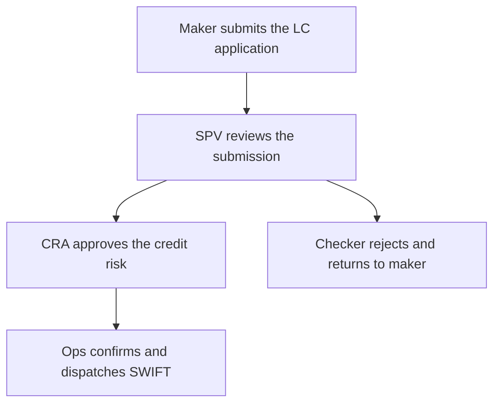

# Flows

### F-U-001 — Letter of Credit Approval

```mermaid
flowchart TD
    A[Maker submits the LC application] --> B[SPV reviews the submission]
    B --> C[CRA approves the credit risk]
    C --> D[Ops confirms and dispatches SWIFT]
    B --> E[Checker rejects and returns to maker]
```
