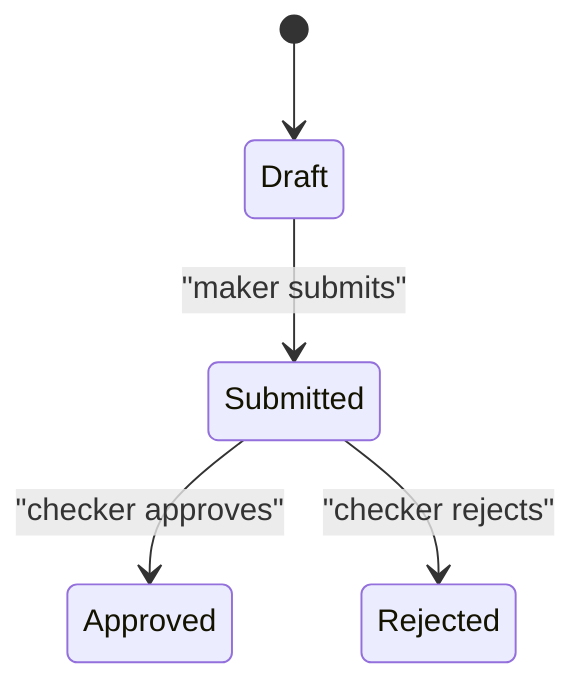

# Import LC Request (maker-checker)

## 4. Inputs
- lc_number
- amount
- beneficiary
- approval_note
- decision
- checked_at

## 8. State Machine

## 11. Source References
- `legacy/import_request.php:1-16` — the 2-step maker-checker import wizard
