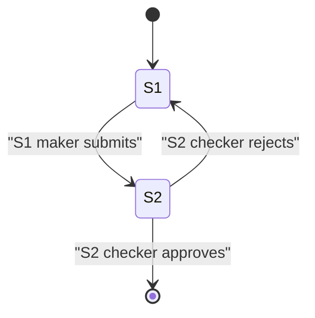

# Import LC Request (maker-checker)

## 3a. Staged inputs (multi-step workflows)

```yaml
stages:
  - stage_id: "S1"
    stage_name: "Maker entry"
    actor_role: "Maker"
    input_fields: ["lc_number", "amount", "beneficiary"]
    transitions: [{ to: "S2", trigger: "submit_step1", conditions: [] }]
    _source: ["legacy/import_request.php:4-10"]
  - stage_id: "S2"
    stage_name: "Checker review"
    actor_role: "Checker"
    input_fields: ["approval_note", "decision"]
    transitions: [{ to: "DONE", trigger: "approve", conditions: ["actor_role in {MGRL1, MGRL2}"] }]
    _source: ["legacy/import_request.php:11-16"]
```

## 4. Inputs
- lc_number
- amount
- beneficiary
- approval_note
- decision
- checked_at

## 8. State Machine


## 11. Source References
- `legacy/import_request.php:1-16` — the 2-step maker-checker import wizard
