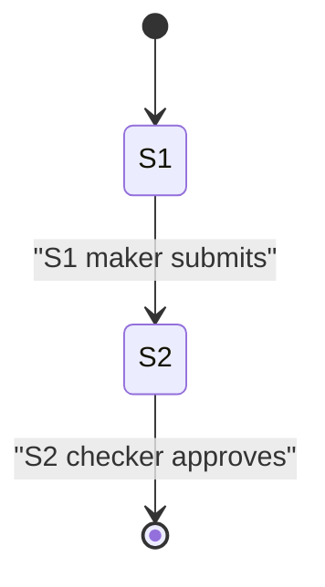

# 04 — Flows
## User flows
### F-U-001: Import LC request (maker-checker)
**Actor / Trigger**: Maker
**Steps**:
1. Stage 1 — maker enters LC details; 2. Stage 2 — checker reviews + decides
**Stages**:
```yaml
stages:
  - stage_id: "S1"
    stage_name: "Maker entry"
    actor_role: "Maker"
    input_fields: ["lc_number", "amount", "beneficiary"]
    transitions: [{ to: "S2", trigger: "submit_step1", conditions: [] }]
    _source: ["legacy/import_request.php:4-10"]
  - stage_id: "S2"
    stage_name: "Checker review"
    actor_role: "Checker"
    input_fields: ["approval_note", "decision"]
    transitions: [{ to: "DONE", trigger: "approve", conditions: [] }]
    _source: ["legacy/import_request.php:11-16"]
```
**Workflow state diagram**:

**_kb_source**: [20-workflows/import-request.md]
**Source**: KB
