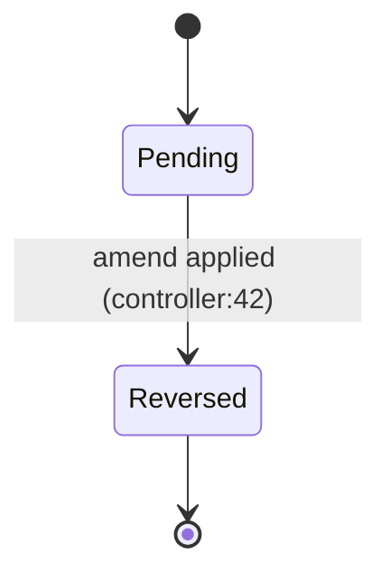

# 1. Purpose

Test fixture: invalid Mermaid (Iter 72 — reproduces TF Import production bug).

## 2. Actors

LC officer.

## 3. Flow (Input → Process → Output)

```mermaid
flowchart TD
    Start(["LC import received"]) --> PRE([LC has flag_amend IN (2.2, 4)])
    PRE --> M1[Reverse Amend Maker\ninput/import_reverse_amends.php]
    M1 --> Decide{Has matching swap?}
    Decide -- if (yes) --> Apply["Apply reversal"]
    Decide -- "no" --> Skip(["No reversal needed"])
    Apply --> End(["End"])
```

## 4. Inputs

LC document with amend flag.

## 5. Process

1. Step 1. [VERIFIED]

## 6. Outputs

Reversed amend record.

## 7. Business Rules

| ID | Rule | Why | Source | Confidence | Mutability |
|---|---|---|---|---|---|
| BR-LC-1 | flag_amend in (2.2, 4) triggers reversal | legacy convention | input/import_reverse_amends.php:42 | [VERIFIED] | [LOCKED] |

## 8. State Machine



## 9. Edge Cases & Gotchas

None.

## 10. Open Questions

None.

## 11. Source References

- input/import_reverse_amends.php:42
