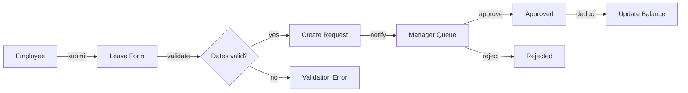

# Leave Management

> **Classification**: workflow
> **Criticality**: high
> **Depends on**: user-management
> **Rebuild Phase**: 1

## 1. Purpose

The leave management domain handles all employee time-off requests, approvals, and balance tracking. [VERIFIED] (`src/controllers/leave.ts:1-5`) Every leave request follows a maker-checker pattern where the submitter cannot approve their own request. [VERIFIED] (`src/middleware/self-approval-guard.ts:12`)

## 2. Actors

| Actor | Role |
|---|---|
| Employee | Submits leave requests via web form. [VERIFIED] (`src/controllers/leave.ts:45`) |
| Manager | Approves/rejects requests in approval queue. [INFERRED] |
| HR Admin | Overrides approvals for policy exceptions. [INFERRED] |

## 3. Flow (Input → Process → Output)



## 4. Inputs

- Employee selects leave type, start date, end date, optional notes. [VERIFIED] (`src/forms/leave-request.ts:8-22`)
- System validates date range against leave balance. [VERIFIED] (`src/validators/leave.ts:12-30`)

## 5. Process

1. Employee submits form → system validates dates and balance. [VERIFIED] (`src/controllers/leave.ts:50-65`)
2. If balance insufficient → reject with message. [VERIFIED] (`src/validators/leave.ts:25-28`)
3. Create leave_request record with status=pending. [VERIFIED] (`src/services/leave.ts:15`)
4. Notify manager via email queue. [INFERRED]
5. Manager approves → deduct from leave_balance. [VERIFIED] (`src/services/leave.ts:40-55`)

## 6. Outputs

- Leave request record persisted to database. [VERIFIED] (`src/models/leave-request.ts:5-20`)
- Email notification to manager (pending) and employee (decision). [INFERRED]

## 7. Business Rules

| ID | Rule | Why | Source | Confidence | Mutability |
|---|---|---|---|---|---|
| BR-LEAVE-1 | Annual leave accrues at 1.25 days per month | Employment contract standard | code-only | [INFERRED] | [INTENT] |
| BR-LEAVE-2 | Sick leave >3 consecutive days requires medical certificate | Labor law compliance | `src/validators/leave.ts:35` | [VERIFIED] (`src/validators/leave.ts:35`) | [LOCKED] |
| BR-LEAVE-3 | Employee cannot approve own leave request (self-approval guard) | Maker-checker separation of duties | `src/middleware/self-approval-guard.ts:12` | [VERIFIED] (`src/middleware/self-approval-guard.ts:12`) | [LOCKED] |
| BR-LEAVE-4 | Requests >5 days escalate to HR for additional approval | Company policy | `src/services/leave.ts:62` | [VERIFIED] (`src/services/leave.ts:62`) | [INTENT] |

## 8. State Machine

```
draft --submit [dates_valid]--> pending (src/controllers/leave.ts:50)
pending --approve [has_balance]--> approved (src/services/leave.ts:40)
pending --reject--> rejected (src/services/leave.ts:70)
approved --cancel [>24h_before_start]--> cancelled (src/services/leave.ts:80)
pending --timeout [>7d_no_action]--> escalated (src/services/leave.ts:90)
```

## 9. Edge Cases & Gotchas

- **Edge Case 1** [VERIFIED] (`src/validators/leave.ts:42`): Zero-day leave request (start_date == end_date) is allowed for half-day requests but the balance deduction rounds to 0.5, not 0. **Rebuild guidance**: replicate (business rule).
- **Edge Case 2** [VERIFIED] (`src/services/leave.ts:95`): Concurrent approval race — two managers can both approve the same request if they click within the same DB transaction window. Legacy has no optimistic locking. **Rebuild guidance**: do-not-replicate (bug — add optimistic locking).
- **Edge Case 3** [OPEN]: Fiscal year boundary — what happens to pending requests when the leave year resets? Legacy code has no handler for this transition. **Rebuild guidance**: open question.

## 10. Open Questions

- [ ] **OQ-LEAVE-1** [P2]: What is the maximum carry-over for annual leave?
- [ ] **OQ-LEAVE-2** [P1]: How should pending requests be handled at fiscal year boundary?

## 11. Source References

- `src/controllers/leave.ts:1-5` — module entry point and purpose
- `src/controllers/leave.ts:45` — leave submission handler
- `src/controllers/leave.ts:50-65` — form validation + creation flow
- `src/models/leave-request.ts:5-20` — leave request entity definition
- `src/validators/leave.ts:12-30` — date + balance validation rules
- `src/validators/leave.ts:25-28` — insufficient balance rejection
- `src/validators/leave.ts:35` — sick leave medical cert check
- `src/validators/leave.ts:42` — zero-day half-day edge case
- `src/services/leave.ts:15` — request creation
- `src/services/leave.ts:40-55` — approval + balance deduction
- `src/services/leave.ts:62` — HR escalation for >5 day requests
- `src/services/leave.ts:70` — rejection handler
- `src/services/leave.ts:80` — cancellation with 24h guard
- `src/services/leave.ts:90` — 7-day timeout escalation
- `src/services/leave.ts:95` — concurrent approval race condition
- `src/middleware/self-approval-guard.ts:12` — maker-checker enforcement
- `src/forms/leave-request.ts:8-22` — form input definition
