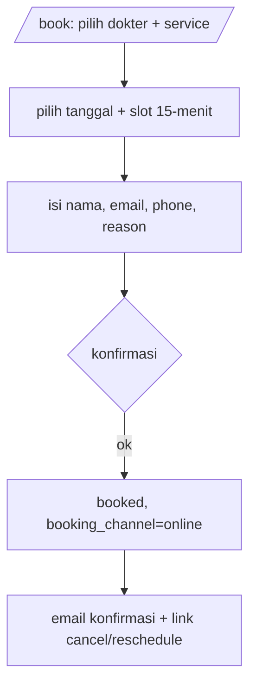
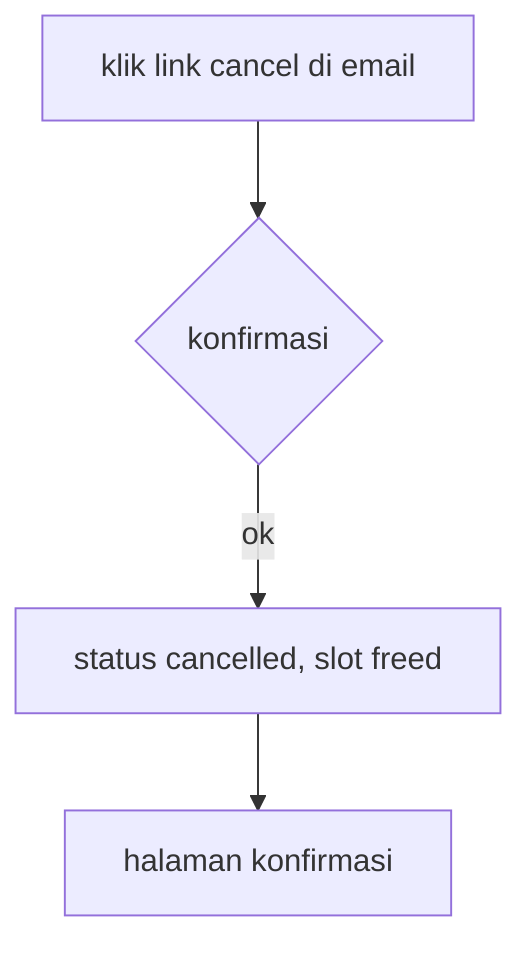
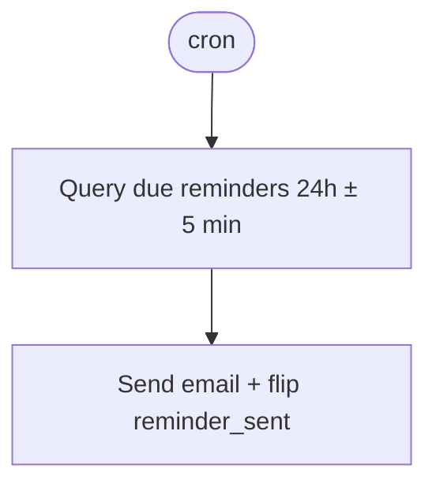

# 04 — Flows

## User flows

### F-U-001: Patient books appointment

**Flow**:

**Definition of Done**:
- [ ] appointment `booked` tercipta + email terkirim (AC-001)
- [ ] slot terisi tak bisa double-book (AC-002)

**Source**: PRD §Clinic.1 F-U-001 (AC1-1, AC1-2)

### F-U-002: Patient cancels appointment

**Flow**:

**Definition of Done**:
- [ ] status `cancelled` + slot freed (AC-003)

**Source**: PRD §Clinic.1 F-U-002 (AC3-1)

## System flows

### F-S-001: Reminder sweep

**Flow**:

**Definition of Done**:
- [ ] reminder fires once, idempotent (AC-004)

**Source**: PRD §Clinic.1 F-U-003 (AC4-1)

## Open Questions

- [ ] **OQ-CLINIC-004** [P2] [business]: If a doctor calls in sick, how does the system handle their booked appointments (auto-notify + reassign, or manual)?
