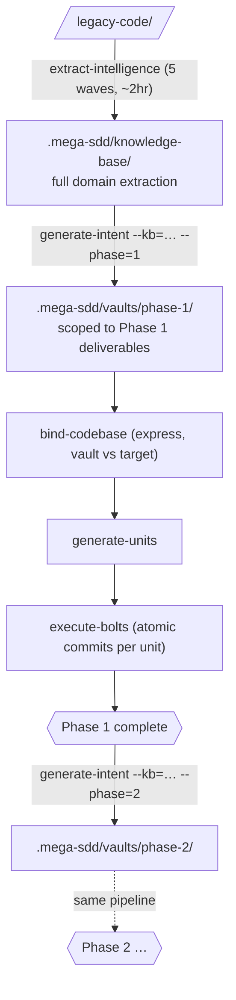

# Scenario 10 — Phased Rebuild Walkthrough

**Time:** ~3 hours wall-clock (mostly idle while extract-intelligence runs in waves; user-active time ~30 min spread across 3 sessions)
**When to use:** legacy codebase rebuild with a multi-phase plan
**Prerequisites:** plugin v6+; existing legacy codebase OR willingness to use sample

> Concept guide for the whole journey (including hand-off + sync after the last phase): [`docs/mega-sdd/revamp-journey.md`](../../docs/mega-sdd/revamp-journey.md).

## What you'll learn

- How to extract a phased rebuild plan from legacy code
- How to generate Phase 1 vault (and what's IN scope vs OUT for that phase)
- Where Phase 2/3+ plans live + how to bootstrap each one
- How execute-bolts hints "Phase N+1 next" when ready

## Story

Imagine you have a legacy PHP app called "TradeFinance" (~50 controllers, 30 models). You want to rebuild on Laravel 12. Senior architect did a 30-min walkthrough; now you want mega-sdd to phase the rebuild.

## Pipeline overview



(The express spine is the default — no separate scan phase; `--classic` restores the scan-first chain.)

## Step 1 — Extract intelligence from legacy

```
/mega-sdd ./old-tradefinance/ --out=./.mega-sdd/
```

(The front door detects a legacy code directory and starts the chain at extract-intelligence; `--out` is required for this lane.)

Expected: ~2hr wall-clock (waves 1-5 run in parallel where possible). Output: `.mega-sdd/knowledge-base/` with 30+ domain files + cross-domain workflows + `99-rebuild-architecture/suggested-phasing.md` (the phase plan).

Verify:
```bash
cat .mega-sdd/knowledge-base/99-rebuild-architecture/suggested-phasing.md | head -40
```

You should see `## Phase 1` / `## Phase 2` / `## Phase 3` headers with scope + acceptance criteria per phase.

## Step 2 — Generate Phase 1 vault

Say "generate intent from the KB, phase 1" — or, when the chain from Step 1 is still live, it proposes this hop itself:

```
generate-intent --kb=.mega-sdd/knowledge-base/ --phase=1
```

(Note: `--phase=1` is default; flag is for documentation clarity here.)

Expected: vault at `.mega-sdd/vaults/<slug>/`. Open `00-index.md`:

```markdown
## Phase context

**Phase:** 1 of 3

**This vault covers:** Core auth + user management + basic transaction listing (per suggested-phasing.md §Phase 1)

**Upcoming phases:**
- Phase 2: Settlement workflow + risk approval
- Phase 3: Reporting + audit log

**To start the next phase** (after this phase's bolts complete):
```bash
generate-intent --kb=.mega-sdd/knowledge-base/ --phase=2
```

**Full phased plan:** `.mega-sdd/knowledge-base/99-rebuild-architecture/suggested-phasing.md`
```

This block tells you exactly what you're building NOW + where Phase 2/3 plans live.

## Step 3 — Scan target scaffold + bind + units + bolts

```
/mega-sdd
```

The front door detects the vault + proposes the chain → bind-codebase (express — GROUND already indexed the target scaffold) → generate-units → execute-bolts. Single confirmation; auto-continues.

Expected halt: maybe `bind_conflict` on some claims. Halt envelope shows `suggested_action: KEEP_VAULT | KEEP_CODE | DEFER | SPLIT`. Choose per claim; pipeline continues.

## Step 4 — Phase 1 complete; next-phase hint surfaces

When Phase 1 bolts finish, execute-bolts handoff `next_action.hint`:

```
Phase 1 complete. Next: Phase 2. Plan: .mega-sdd/knowledge-base/99-rebuild-architecture/suggested-phasing.md §Phase 2
```

orchestrate-flow final summary repeats:

```
Phase 1 of 3 complete. To start Phase 2: see suggested-phasing.md §Phase 2 OR run generate-intent --kb=.mega-sdd/knowledge-base/ --phase=2.
```

## Step 5 — Start Phase 2

Say "generate intent from the KB, phase 2" (the typed skill commands were removed at 6.0.0 — phrases route):

```
generate-intent --kb=.mega-sdd/knowledge-base/ --phase=2
```

NEW vault at `.mega-sdd/vaults/<slug-phase-2>/` scoped to Phase 2 deliverables. `00-index.md` Phase context now shows "Phase 2 of 3" + "Phase 3" upcoming.

Run pipeline again. Repeat for Phase 3.

## Pass criteria

- `suggested-phasing.md` has ≥2 `## Phase` headers
- Phase 1 vault `00-index.md` has §Phase context block with phase 1 of N + upcoming phases listed + next-phase command verbatim
- vault.json has `phase: 1`, `phase_total: N` fields
- execute-bolts end-of-Phase-1 surfaces "Phase 2 next" hint
- Phase 2 vault is distinct from Phase 1 vault (separate `.mega-sdd/vaults/` subdirectory)

## Failure modes

- `suggested-phasing.md` absent → fallback `phase: 1, phase_total: 1` (treats as single-phase); user can manually edit suggested-phasing.md to add phases
- `--phase=2` requested when phase_total=1 → invocation-time error: "Phase 2 requested but suggested-phasing.md has only 1 phase. Available: 1..1."
- Phase 2 vault references entities from Phase 1 that weren't built → manual review; expected behavior for cross-phase dependencies

## Related artifacts

- `docs/mega-sdd/reading-map.md` §Stage 2 (vault) — where to read at each phase
- `plugins/mega-sdd/skills/extract-intelligence/references/knowledge-base-schema.md` §suggested-phasing.md — KB phase plan format
- `plugins/mega-sdd/skills/generate-intent/SKILL.md` Step 2.5 — --phase flag parsing

## See also

- [scenario-4 — Legacy rebuild](scenario-4-legacy-rebuild.md) — single-phase legacy rebuild
- [`docs/mega-sdd/revamp-journey.md`](../../docs/mega-sdd/revamp-journey.md) — the end-to-end revamp concept guide (extraction → build → hand-off → sync)
- [scenario-6 — Recovery from halt](scenario-6-recovery-from-halt.md) — if bind_conflict fires
- `docs/mega-sdd/upgrade-from-old-version.md` — if upgrading from older mega-sdd
