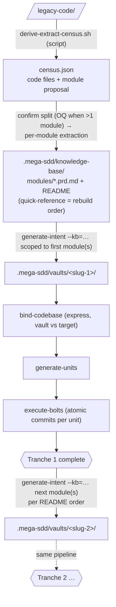

# Scenario 10 — Phased Rebuild Walkthrough

**Time:** varies with the census (user-active time ~30 min spread across sessions; extraction cost scales with module count)
**When to use:** legacy codebase rebuild you want to land module-by-module instead of all at once
**Prerequisites:** plugin v7.6+; existing legacy codebase OR willingness to use sample

> Concept guide for the whole journey (including hand-off + sync after the last tranche): [`docs/mega-sdd/revamp-journey.md`](../../docs/mega-sdd/revamp-journey.md).

## What you'll learn

- How the census proposes the module split — **module is the phasing unit**
- Where the recommended rebuild order lives (KB README module quick-reference, derived from `depends_on`)
- How to scope each vault to the module(s) you're building NOW (and keep the rest honest as OQs)
- Why `--phase=N` survives only for pre-existing numbered-tree KBs

## Story

Imagine you have a legacy PHP app called "TradeFinance" (~50 controllers, 30 models). You want to rebuild on Laravel 12. Senior architect did a 30-min walkthrough; now you want mega-sdd to phase the rebuild.

## Pipeline overview



(The express spine is the default — no separate scan phase; `--classic` restores the scan-first chain.)

## Step 1 — Extract intelligence from legacy

```
/mega-sdd ./old-tradefinance/ --out=./.mega-sdd/
```

(The front door detects a legacy code directory and starts the chain at extract-intelligence; `--out` is required for this lane.)

The census script enumerates the code files (logs/backups/data excluded by construction) and proposes a module split; with >1 module proposed you confirm the split once (**Pakai pecahan ini** / **Ubah** / **Stop**), then one `domain-extractor` agent extracts each module — the field replay measured the census itself at 0.13s, and a single-module legacy runs on the main thread with zero dispatches.

Output: `.mega-sdd/knowledge-base/` with `census.json` + `modules/<domain>.prd.md` (one PRD-kontrak per module) + `README.md` — whose **module quick-reference table carries the recommended rebuild order** (from `depends_on`). That table IS the phase plan.

Verify:
```bash
grep -A 12 "Module quick reference" .mega-sdd/knowledge-base/README.md
```

You should see one row per module: classification + criticality + recommended rebuild order.

## Step 2 — Generate the first vault, scoped to the leading module(s)

Say "generate intent from the KB" — or, when the chain from Step 1 is still live, it proposes this hop itself:

```
generate-intent --kb=.mega-sdd/knowledge-base/
```

Consuming ALL modules is the default. To phase, scope the vault to the first module(s) in the README's recommended order and record the out-of-scope modules as **explicit constraints/OQs** — nothing silently drops. (For a single-module tranche you can also point Mode A directly at that one `modules/<domain>.prd.md`.)

Expected: vault at `.mega-sdd/vaults/<slug>/` covering (say) reference-data + auth-rbac + customer master — the order rows the README put first — with entries like:

```markdown
## Constraints — out-of-scope modules (this tranche)

- import-lc, swift-messaging, reporting: NOT in this vault's scope; rebuild per
  README module quick-reference order. Cross-module entities they depend on are
  listed as OQs below.
```

This block tells you exactly what you're building NOW + where the rest of the plan lives (the KB README order).

## Step 3 — Bind + units + bolts for the tranche

```
/mega-sdd
```

The front door detects the vault + proposes the chain → bind-codebase (express — GROUND already indexed the target scaffold) → generate-units → execute-bolts. Single confirmation; auto-continues.

Expected halt: maybe `bind_conflict` on some claims. Halt envelope shows `suggested_action: KEEP_VAULT | KEEP_CODE | DEFER | SPLIT`. Choose per claim; pipeline continues.

## Step 4 — Tranche complete; pick the next module(s)

When the tranche's bolts finish, go back to the KB README's module quick-reference: the next row(s) in the recommended rebuild order are your next tranche.

```
generate-intent --kb=.mega-sdd/knowledge-base/
```

NEW vault at `.mega-sdd/vaults/<slug-2>/` scoped to the next module(s); out-of-scope modules again recorded explicitly. Run the pipeline again. Repeat until the order table is exhausted.

## Pass criteria

- KB README module quick-reference table present, one row per module, with recommended rebuild order (derived from `depends_on`)
- Each tranche's vault is a distinct `.mega-sdd/vaults/` subdirectory
- Out-of-scope modules appear as explicit constraints/OQs in the scoped vault (never silently dropped)
- `--phase=N` against a PRD-kontrak KB logs "PRD-kontrak KB has no phase lane (module = phasing unit); flag ignored" and proceeds — never halts

## Back-compat — pre-existing numbered-tree KBs keep `--phase`

A KB extracted before the PRD-kontrak grammar (the `00-overview/` … `99-rebuild-architecture/` tree) stays readable everywhere, and its phase lane still works:

```
generate-intent --kb=<legacy-kb>/ --phase=2
```

reads `99-rebuild-architecture/suggested-phasing.md`, counts the `## Phase` headings → `phase_total`, and persists `phase`/`phase_total` to vault.json. Out-of-range N → invocation-time error ("Phase 2 requested but suggested-phasing.md has only 1 phase. Available: 1..1."); file absent → single-phase fallback. New extractions never write this machinery — the README module order replaces it.

## Failure modes

- Census proposes exactly 1 module → no split confirmation, nothing to phase; one vault consumes the whole KB
- A later tranche references entities from an earlier module that wasn't built yet → manual review; expected behavior for cross-module dependencies
- You disagree with the proposed split → answer **Ubah** at the confirmation OQ (merge/split/rename; re-presented once)

## Related artifacts

- `docs/mega-sdd/reading-map.md` §Stage 2 (vault) — where to read at each stage
- `plugins/mega-sdd/skills/extract-intelligence/references/prd-kontrak-template.md` §README roll-up — the module quick-reference format (the phase plan's home)
- `plugins/mega-sdd/skills/generate-intent/references/kb-submode.md` §Consumption — PRD-kontrak grammar (multi-module scoping) + §Consumption — legacy numbered-tree grammar (`--phase` back-compat)

## See also

- [scenario-4 — Legacy rebuild](scenario-4-legacy-rebuild.md) — the single-tranche legacy rebuild
- [`docs/mega-sdd/revamp-journey.md`](../../docs/mega-sdd/revamp-journey.md) — the end-to-end revamp concept guide (extraction → build → hand-off → sync)
- [scenario-6 — Recovery from halt](scenario-6-recovery-from-halt.md) — if bind_conflict fires
- `docs/mega-sdd/upgrade-from-old-version.md` — if upgrading from older mega-sdd
