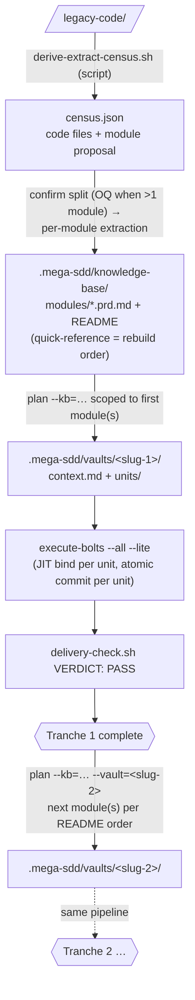

# Scenario 10 — Phased Rebuild Walkthrough

**Time:** varies with the census (user-active time ~30 min spread across sessions; extraction cost scales with module count)
**When to use:** legacy codebase rebuild you want to land module-by-module instead of all at once
**Prerequisites:** mega-sdd 9.0+ (`extract-intelligence` → `plan --kb`); existing legacy codebase OR willingness to use sample

The KB-born rebuild runs the one guarded pipeline: `extract-intelligence` → `plan --kb=<kb>` → `execute-bolts --all --lite` (each unit bound just in time at dispatch).

> Concept guide for the whole journey (including hand-off + sync after the last tranche): [`docs/mega-sdd/revamp-journey.md`](../../docs/mega-sdd/revamp-journey.md).

## What you'll learn

- How the census proposes the module split — **module is the phasing unit**
- Where the recommended rebuild order lives (KB README module quick-reference, derived from `rebuild_after`)
- How to scope each vault to the module(s) you're building NOW (and keep the rest honest as OQs)
- Why `--phase=N` survives only for pre-existing numbered-tree KBs

## Story

Imagine you have a legacy PHP app called "TradeFinance" (~50 controllers, 30 models). You want to rebuild on Laravel 12. Senior architect did a 30-min walkthrough; now you want mega-sdd to phase the rebuild.

## Pipeline overview


```mermaid
flowchart TD
    L[/"legacy-code/"/] -->|"derive-extract-census.sh (script)"| C["census.json<br/>code files + module proposal"]
    C -->|"confirm split (OQ when >1 module) →<br/>per-module extraction"| KB[".mega-sdd/knowledge-base/<br/>modules/*.prd.md + README<br/>(quick-reference = rebuild order)"]
    KB -->|"plan --kb=… scoped to first module(s)"| V1[".mega-sdd/vaults/&lt;slug-1&gt;/<br/>context.md + units/"]
    V1 --> EB1["execute-bolts --all --lite<br/>(JIT bind per unit, atomic commit per unit)"]
    EB1 --> DC1["delivery-check.sh VERDICT: PASS"]
    DC1 --> DONE1{{"Tranche 1 complete"}}
    DONE1 -->|"plan --kb=… --vault=&lt;slug-2&gt;<br/>next module(s) per README order"| V2[".mega-sdd/vaults/&lt;slug-2&gt;/"]
    V2 -.->|"same pipeline"| DONE2{{"Tranche 2 …"}}
```

(GROUND — a script, seconds — indexes the target scaffold; there is no scan phase and no bind phase: each unit is bound at dispatch.)

## Step 1 — Extract intelligence from legacy

```
/mega-sdd ./old-tradefinance/ --out=./.mega-sdd/
```

(The front door detects a legacy code directory and starts the chain at extract-intelligence; `--out` is required for this lane.)

The census script enumerates the code files (logs/backups/data excluded by construction) and proposes a module split; with >1 module proposed you confirm the split once (**Pakai pecahan ini** / **Ubah** / **Stop**), then one `domain-extractor` agent extracts each module — the field replay measured the census itself at 0.13s, and a single-module legacy runs on the main thread with zero dispatches.

Output: `.mega-sdd/knowledge-base/` with `census.json` + `modules/<domain>.prd.md` (one PRD-kontrak per module) + `README.md` — whose **module quick-reference table carries the recommended rebuild order** (from `rebuild_after`). That table IS the phase plan.

Verify:
```bash
grep -A 12 "Module quick reference" .mega-sdd/knowledge-base/README.md
```

You should see one row per module: classification + criticality + recommended rebuild order.

## Step 2 — Plan the first vault, scoped to the leading module(s)

Say "rebuild from KB" — or, when the chain from Step 1 is still live, it proposes this hop itself (`plan --kb=<out>/knowledge-base/ --lite --mode=<existing|new>`):

```
plan --kb=.mega-sdd/knowledge-base/
```

Consuming ALL modules is the default. To phase, tell `plan` which module(s) this tranche covers — the first rows of the README's recommended order (there is no flag for it). Nothing may silently drop: `plan`'s coverage gate (`validate-plan-coverage.sh --kb=`, Step 5) censuses every heading of every `modules/*.prd.md`, and a heading of an out-of-scope module is covered only by an **OQ that quotes the heading and names the module file** — a constraint row alone does not count, and a missing one halts `plan_coverage_gap`. (For a single-module tranche you can also point `plan` at that one `modules/<domain>.prd.md` as a positional PRD — a plain PRD run, so it reads only that file, not the KB README or `data-mutation-policy.md`.)

Expected: vault at `.mega-sdd/vaults/<slug>/` (the slug comes from the census `legacy_root`) — `context.md` + `units/` covering (say) reference-data + auth-rbac + customer master — the order rows the README put first — with entries like:

```markdown
## Constraints

- Tranche 1 rebuilds reference-data, auth-rbac and customer-master — the first rows of the
  KB README module quick-reference. The other modules follow in later tranches, per that order.

## Open Questions

- [ ] **OQ-CN-4** [P3] [business]: "2. Business Rules" (import-lc.prd.md) is outside tranche 1 —
  rebuilt in a later tranche per the README module order.
```

(one such OQ per heading of every out-of-scope module). This tells you exactly what you're building NOW + where the rest of the plan lives (the KB README order).

## Step 3 — Bolts for the tranche

```
/mega-sdd
```

The front door re-derives state (GROUND) and proposes `execute-bolts` for the new units — single confirmation; auto-continues. Open P1 business OQs that `plan`'s batched ask left unanswered route to `resolve-oq` first. Each unit is bound just in time at dispatch (execute-bolts pre-flight 3.9 → `bolts/U-XXX/binding.json`).

Expected halt: maybe `binding_conflict` on some claims. The envelope shows `suggested_action: KEEP_VAULT | KEEP_CODE | DEFER | SPLIT` with its keterangan; the CONFLICT closes that unit only (dependents skip with the reason, the rest proceed). Choose per claim; pipeline continues.

The tranche ends with the result contract every lane delivers: the acceptance-criterion → test table, `delivery-check.sh` `VERDICT: PASS` on the final commit, and the assumptions and decisions made.

## Step 4 — Tranche complete; pick the next module(s)

When the tranche's bolts finish, go back to the KB README's module quick-reference: the next row(s) in the recommended rebuild order are your next tranche.

```
plan --kb=.mega-sdd/knowledge-base/ --vault=.mega-sdd/vaults/<slug-2>
```

`--vault=` is required from tranche 2 on: the default vault dir comes from the census `legacy_root`, so it is the same for every tranche, and `plan` refuses an existing vault without `--regenerate` (which would rewrite tranche 1). NEW vault at `.mega-sdd/vaults/<slug-2>/` scoped to the next module(s); out-of-scope modules — including the ones earlier tranches built — again recorded as OQs. Run the pipeline again. Repeat until the order table is exhausted.

## Pass criteria

- KB README module quick-reference table present, one row per module, with recommended rebuild order (derived from `rebuild_after`)
- Each tranche's vault is a distinct `.mega-sdd/vaults/` subdirectory
- Every heading of an out-of-scope module is covered by an OQ that quotes it and names the module file (never silently dropped); `validate-plan-coverage.sh` PASS for each tranche (`.mega-sdd/.plan-coverage-state.json`)
- Each tranche ends with `delivery-check.sh` `VERDICT: PASS` on its final commit and the result contract in chat
- `--phase=N` against a PRD-kontrak KB logs "PRD-kontrak KB has no phase lane (module = phasing unit); flag ignored" and proceeds — never halts

## Back-compat — pre-existing numbered-tree KBs keep `--phase`

A KB extracted before the PRD-kontrak grammar (the `00-overview/` … `99-rebuild-architecture/` tree) stays readable everywhere, and its phase lane still works:

```
plan --kb=<legacy-kb>/ --phase=2
```

reads `99-rebuild-architecture/suggested-phasing.md`, counts the `## Phase` headings → `phase_total`, and persists `phase`/`phase_total` to vault.json (through `derive-vault-json.sh --patch`). Out-of-range N → invocation-time error; file absent → single-phase fallback. New extractions never write this machinery — the README module order replaces it.

## Failure modes

- Census proposes exactly 1 module → no split confirmation, nothing to phase; one vault consumes the whole KB
- A later tranche references entities from an earlier module that wasn't built yet → manual review; expected behavior for cross-module dependencies
- You disagree with the proposed split → answer **Ubah** at the confirmation OQ (merge/split/rename; re-presented once)
- `plan_coverage_gap` naming headings of a module you meant to leave out → add the OQ (quote the heading, name `<module>.prd.md`), not a constraint row
- Tranche-2 `plan` without `--vault=` → stops with one line (the vault exists); re-run with a new `--vault=`

## Related artifacts

- `docs/mega-sdd/reading-map.md` — where to read at each stage
- `plugins/mega-sdd/skills/extract-intelligence/references/prd-kontrak-template.md` §README roll-up — the module quick-reference format (the phase plan's home)
- `plugins/mega-sdd/skills/plan/references/kb-input.md` §Consumption — PRD-kontrak grammar (multi-module scoping) + §Consumption — legacy numbered-tree grammar (`--phase` back-compat) + §KB coverage rule

## See also

- [scenario-4 — Legacy rebuild](scenario-4-legacy-rebuild.md) — the single-tranche legacy rebuild
- [`docs/mega-sdd/revamp-journey.md`](../../docs/mega-sdd/revamp-journey.md) — the end-to-end revamp concept guide (extraction → build → hand-off → sync)
- [scenario-6 — Recovery from halt](scenario-6-recovery-from-halt.md) — if `binding_conflict` fires
- `docs/mega-sdd/upgrade-from-old-version.md` — if upgrading from older mega-sdd
