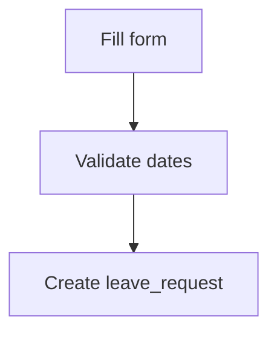
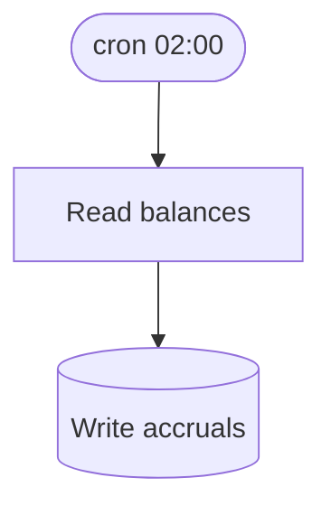

# Context: Demo Leave System

## Overview

Demo leave system overview.

## Flows

### F-U-001: Submit leave request

**Flow**:


**Definition of Done**:
- [ ] request row created
- [ ] manager notified
- [x] audit written

**Source**: PRD §3.1 (AC1-1, AC1-2, AC1-2)

### F-S-002: Nightly accrual

**Flow**:


**Definition of Done**:
- [ ] balances updated

**_kb_source**: [20-workflows/accrual.md]
**Source**: PRD §4

## Data model

```dbml
// Purpose: System user account
Table user {
  id bigint [pk, increment]
  email varchar [unique]
  name varchar
  created_at timestamp [default: `now()`]
  updated_at timestamp
}

Table leave_request {
  id bigint [pk, increment]
  user_id bigint
  status varchar
  indexes {
    (user_id)
  }
}

Ref: leave_request.user_id > user.id
```

### leave_request

- **Purpose**: Leave request lifecycle
- **Key fields**: user_id, status

## Constraints

NFR: median response < 300ms per PRD SLA.

### Performance

- **Purpose**: a sibling-section H3 that must NEVER parse as an entity

| NFR | Target | Source |
|---|---|---|
| latency | p50 < 300ms | PRD §6 |

## Decisions

### D-001: Use PostgreSQL
Managed relational store. **Decision**: Postgres 16. **Consequences**: SQL skills reusable, vendor lock modest. **Source**: PRD §2.

### D-002: Legacy session auth
**Status**: Superseded by D-003
**Source**: PRD §5.

## Open Questions

- [ ] **OQ-AR-1** [P1] [tech / scan] [conf: high] [origin: context.md#Overview]: which test framework? — resolve: scan codebase-map §test_frameworks
- [ ] **OQ-AR-7** [P2] [tech / recommend] [conf: medium] [origin: context.md#Overview]: what HTTP error envelope shape? **Deferred (v1.1)**: waiting on platform team ruling
- [~] **OQ-AR-9** [P3] [business] [origin: context.md#Overview]: support SOAP fallback? → Out of Scope v1.1: REST only per PRD.
- [x] **OQ-DM-1** [P1] [origin: context.md#Data-model]: which ID type? → **Resolved v1.1** (2026-07-19): UUID.
- [ ] **OQ-FL-2** [P2] [origin: context.md#F-U-001]: notification channel unclear — resolve: PM
- [ ] **OQ-CN-3** [P2]: how should **Deferred** settlement deep-links batch?
- [ ] **OQ-CN-4** [P3]: data retention period? **Deferred (v1.2)**: waiting on legal review
  (follow-up booked with the platform team)
